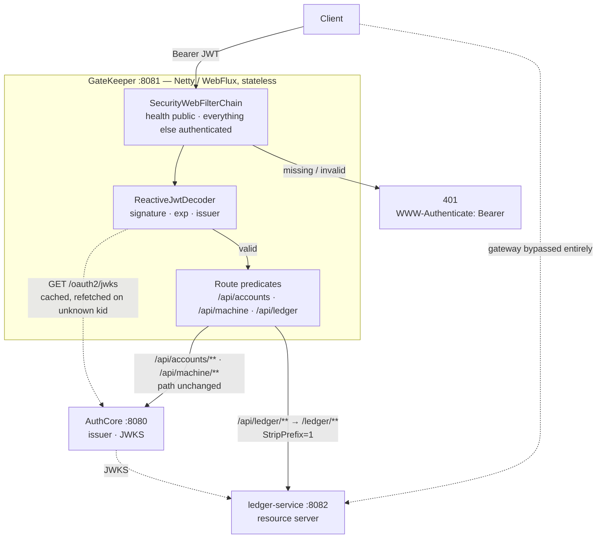

# GateKeeper

A reactive API gateway on Spring Cloud Gateway 5 and Netty, sitting in front of the AuthCore platform. It terminates unauthenticated traffic at the edge and routes what survives to the service that owns the data.

GateKeeper is the middle service of three. **AuthCore** (`:8080`) authenticates users and issues RS256-signed JWTs. **ledger-service** (`:8082`) owns ledger data and decides, per request, who may read or change it. This service (`:8081`) is the front door: it verifies that a request carries a genuine, unexpired token from AuthCore, and forwards it to the right downstream at the right path.

The thing worth understanding before anything else: **the gateway is a coarse first layer, not the security boundary.** It refuses traffic that obviously does not belong, which keeps unauthenticated load off the services behind it. It does not decide what an authenticated caller may do, and nothing downstream takes its word for anything — ledger-service re-verifies every token against AuthCore's JWKS itself and is exactly as secure when the gateway is bypassed entirely.

That division is the whole design. A gateway that owns authorization becomes a single point of failure whose compromise unlocks everything behind it. This one is built so that removing it weakens throughput, not security.

**Scope:** this repository covers milestones M0–M2 — a running reverse proxy that authenticates AuthCore-issued JWTs. Route-level authorization, rate limiting, and revocation are planned and **not built**. [Known limitations](#known-limitations) and [Roadmap](#roadmap) say exactly where the line is.

---

## Contents

- [Quickstart](#quickstart)
- [What it does](#what-it-does)
- [Platform](#platform)
- [Architecture](#architecture)
- [Routes](#routes)
- [Authentication](#authentication)
- [Issuer pinning, and the trap it exists to catch](#issuer-pinning-and-the-trap-it-exists-to-catch)
- [The identity headers it stamps](#the-identity-headers-it-stamps)
- [Why reactive here, when ledger-service is not](#why-reactive-here-when-ledger-service-is-not)
- [Testing](#testing)
- [Known limitations](#known-limitations)
- [Roadmap](#roadmap)

---

## Quickstart

Requires JDK 21.

```bash
git clone https://github.com/ezat141/gatekeeper.git
cd gatekeeper
./mvnw spring-boot:run        # .\mvnw.cmd on Windows
```

The gateway listens on `:8081`. Health is public:

```bash
curl http://localhost:8081/actuator/health
```

**It starts without AuthCore running.** `NimbusReactiveJwtDecoder.withJwkSetUri(...)` builds its key source lazily — nothing is fetched until the first request that actually needs a signature checked. An unreachable AuthCore is a per-request failure, not a startup failure, which is also why every test in this repository points `jwk-set-uri` at a WireMock stub rather than a real server.

Any request that is not health, with no token, is refused before routing is consulted:

```bash
curl -i http://localhost:8081/api/ledger/entries
# 401, WWW-Authenticate: Bearer
```

To exercise the proxy for real you need the other two services on `:8080` and `:8082`, and a token from AuthCore's authorization-code flow. **Obtain it through `localhost`, not `127.0.0.1`** — see [Issuer pinning](#issuer-pinning-and-the-trap-it-exists-to-catch), which is the single most likely reason a valid-looking token gets a `401` here.

Run the suite — no Docker required, since WireMock stands in for both AuthCore and the downstreams:

```bash
./mvnw test
```

---

## What it does

| Capability | Detail |
|---|---|
| Reverse proxy | Three routes to two downstreams, path predicates, prefix rewriting |
| Path rewriting | `StripPrefix=1` on the ledger route only — deliberately not on the others |
| JWT authentication | Every non-health request must carry a valid, unexpired AuthCore token |
| JWKS trust anchor | Public keys fetched from AuthCore, never copied into configuration |
| Key rotation support | An unresolvable `kid` triggers a JWKS refetch, so a rotated key is picked up without redeploying |
| Issuer pinning | Tokens from an unexpected `iss` are refused even when the signature is valid |
| Stateless | No session, no CSRF token, no server-side state. Killable and restartable at any moment |
| Public health | `/actuator/health` reachable without a credential, so liveness can be probed |

**Stack:** Java 21 · Spring Boot 4.0.7 · Spring Cloud 2025.1.2 (Gateway 5.0.2) · Spring Security 7 reactive · Netty · WireMock

### Why Boot 4.0.7 and not 4.1

AuthCore and ledger-service run Spring Boot 4.1. This service runs **4.0.7**, one minor behind, because Spring Cloud Gateway 5.0.2 is built and tested against that version. Running the officially tested combination removes a class of reactive failures that are genuinely unpleasant to debug.

The version skew is not a compromise to apologise for — it is the clearest evidence that the three services are coupled by a wire contract rather than by shared JARs. They agree on JWKS, on claim names, and on nothing else. If matching Boot versions were required, the coupling would be tighter than advertised.

One packaging note that costs an hour if you hit it: the starter is **`spring-cloud-starter-gateway-server-webflux`**. Spring Cloud Gateway 5.x renamed it; the older `spring-cloud-starter-gateway` coordinate that appears in most tutorials no longer resolves.

---

## Platform

| Service | Port | Owns | Repo |
|---|---|---|---|
| **AuthCore** | `:8080` | Authenticating users, issuing and signing JWTs, publishing JWKS | [ezat141/authcore](https://github.com/ezat141/authcore) |
| **GateKeeper** | `:8081` | Routing, edge rejection of unauthenticated traffic | this repo |
| **ledger-service** | `:8082` | Ledger data, and fine-grained authorization over it | [ezat141/ledger-service](https://github.com/ezat141/ledger-service) |

Each service holds only the public half of AuthCore's signing keys, fetched from JWKS. Only AuthCore holds a private key, and only AuthCore decides anyone's roles or permissions. GateKeeper never issues a token, never mints a claim, and never overrules a downstream's refusal.

---

## Architecture



The dashed line from the client straight to ledger-service is the important one. It is not a gap in the diagram — it is a supported path. ledger-service verifies tokens against AuthCore's JWKS on its own and enforces its own tenant and permission rules, so bypassing this gateway costs you rate limiting and routing convenience, and buys you nothing in access.

---

## Routes

Defined declaratively in [`application.yml`](src/main/resources/application.yml).

| Path at the gateway | Downstream | Filters | Path the downstream sees |
|---|---|---|---|
| `/api/accounts/**` | AuthCore `:8080` | none | `/api/accounts/**` — unchanged |
| `/api/machine/**` | AuthCore `:8080` | none | `/api/machine/**` — unchanged |
| `/api/ledger/**` | ledger-service `:8082` | `StripPrefix=1` | `/ledger/**` |

The asymmetry is the interesting part, and it is deliberate. The gateway namespaces every downstream under `/api`, which gives callers one coherent surface. AuthCore already serves `/api/accounts` and `/api/machine` verbatim, so those paths forward untouched. ledger-service serves `/ledger/**` with no `/api` prefix of its own, so that leading segment has to be removed before forwarding.

Getting this backwards fails in a way that is annoying to diagnose: a stripped AuthCore route produces a `404` from AuthCore rather than an error from the gateway, so the gateway looks fine and the downstream looks broken. Three of the four routing tests exist to pin exactly this — `StripPrefix` must apply to the ledger route and must not apply to the other two.

A path matching no predicate is not forwarded anywhere. It returns `404` from the gateway itself.

---

## Authentication

A single `SecurityWebFilterChain` ([`GatewaySecurityConfig`](src/main/java/com/gatekeeper/config/GatewaySecurityConfig.java)):

```java
.csrf(ServerHttpSecurity.CsrfSpec::disable)
.httpBasic(ServerHttpSecurity.HttpBasicSpec::disable)
.formLogin(ServerHttpSecurity.FormLoginSpec::disable)
.authorizeExchange(exchange -> exchange
        .pathMatchers("/actuator/health", "/actuator/health/**").permitAll()
        .anyExchange().authenticated())
.oauth2ResourceServer(resourceServer -> resourceServer
        .jwt(jwt -> jwt.jwtDecoder(jwtDecoder)))
```

CSRF, HTTP Basic, and form login are all off. A credential arrives on every request, so a session would add server-side state and CSRF exposure in exchange for nothing. This chain replaces Boot's default deny-all, which gets installed merely because the resource-server starter is on the classpath.

**M2 answers exactly one question: is this a valid, unexpired token from AuthCore.** Whether the caller may reach a particular route is M4, and mixing the two now would bury the route rules inside this method later, where nobody would find them. `anyExchange().authenticated()` is the whole authorization model today, and it is deliberately blunt.

Trust is anchored on AuthCore's JWKS rather than a public key copied into configuration ([`JwtDecoderConfig`](src/main/java/com/gatekeeper/config/JwtDecoderConfig.java)). That is what lets AuthCore rotate its signing key without a redeploy here — and AuthCore does support live rotation, so this matters in practice rather than in principle.

### What the default validator checks, and what it does not

`JwtValidators.createDefaultWithIssuer(issuer)` composes `X509CertificateThumbprintValidator`, `JwtTimestampValidator` (so `exp`, and `nbf` when present), `JwtTypeValidator`, and a `JwtIssuerValidator` built from the pinned issuer.

**Audience is not validated.** AuthCore emits `aud`, and nothing here checks it, so a token minted for one client is accepted by the gateway on behalf of any other.

That is acceptable *only* because of what this service is. The gateway is not the party a token is addressed to — it is a pass-through, and the downstream resource server re-verifies independently. It would stop being acceptable the moment GateKeeper made any decision that depended on which client a token was issued to. Recorded here so that if it changes, it changes deliberately rather than by inheritance.

---

## Issuer pinning, and the trap it exists to catch

This is the most likely reason a token that looks entirely correct gets a `401` from this service.

AuthCore does not set `issuer-uri`, so Spring Authorization Server derives the issuer from the request host. A token obtained at `127.0.0.1:8080` carries `iss: http://127.0.0.1:8080`. One obtained at `localhost:8080` carries `iss: http://localhost:8080`. Those are different strings, and the validator refuses the mismatch.

Same key. Same signature. Same expiry. Still refused.

```
token minted with iss=http://localhost:8080   → 200, proxied
token minted with iss=http://127.0.0.1:8080   → 401
```

Failing closed is correct — an issuer check that shrugs at a hostname it was not configured for is not an issuer check. The problem is purely that the failure is silent about its cause: you get a bare `401` with nothing indicating that the *issuer* is what was wrong. Hence this section, and hence `refusesATokenFromAnUnexpectedIssuer` in the test suite, which exists specifically to stop someone "fixing" a mysterious `401` by deleting the validator.

**Practical rule:** use `localhost` consistently across all three services. The durable fix is to pin AuthCore's own `issuer-uri` in its `AuthorizationServerSettings`, which makes the issuer deterministic regardless of the host a token was obtained through. That is deliberately not done yet — this milestone is scoped to leave AuthCore untouched.

---

## The identity headers it stamps

ledger-service's README describes three headers — `X-GK-Subject`, `X-GK-Tenant`, `X-GK-Permissions` — and a `GET /ledger/whoami` endpoint that reports them back for inspection. This gateway stamps them, from verified claims only.

The work splits across two filters, and the split is the design rather than an accident of structure.

`InboundHeaderStripFilter` is a `WebFilter` at `HIGHEST_PRECEDENCE`, which puts it ahead of Spring Security's own chain at order `-100`. It removes **every** inbound header whose name begins with `X-GK-`, matched case-insensitively rather than against a fixed list of three, so a fourth header added later cannot silently become spoofable. It strips unconditionally — on every route including permitted ones, and before authentication runs, so a request that fails authentication cannot launder a header through an error path.

`IdentityStampFilter` is a `GlobalFilter`, which runs inside the gateway handler and therefore after Spring Security has authenticated. It reads the verified `Jwt` from `ReactiveSecurityContextHolder` and sets the three headers from its claims. A claim AuthCore omits produces no header at all rather than an empty one a downstream might misread — every client-credentials token lacks `tenant` and `permissions`, so this is the normal case, not an edge one.

One class cannot occupy both positions. Stripping needs the request untouched and must precede authentication; stamping needs the authentication result and cannot precede it.

**These headers are still not authoritative, and that has not changed.** ledger-service re-derives the caller's tenant and permissions from the token's own verified claims and treats `X-GK-*` as informational — its `whoami` endpoint demonstrates exactly that, reporting header-asserted identity beside token-derived identity and flagging any disagreement. The gateway stamping them is a convenience for downstreams that are not themselves resource servers, layered on top of a boundary that was built first and holds without it.

---

## Why reactive here, when ledger-service is not

ledger-service's README argues the servlet side of this: an ordinary CRUD service doing one lookup per request has no reason to pay for a reactive programming model. Both halves of that argument are the same argument, and this is the other half.

A gateway is the component the trade actually favours. It performs almost no per-request CPU work — it matches a predicate, checks a signature, and copies bytes between two connections. What it does do is hold a great many connections open simultaneously, each one idle most of its life waiting on a downstream. On a thread-per-request model, concurrency is capped by the thread pool and most of those threads are parked doing nothing. On Netty, an idle connection costs a socket rather than a thread.

The cost is real and worth naming rather than glossing:

| Servlet habit | Reactive equivalent | What happens if you forget |
|---|---|---|
| `SecurityFilterChain` | `SecurityWebFilterChain` | Bean never applies; Boot's default deny-all stays in force |
| `OncePerRequestFilter` | `GlobalFilter` / `WebFilter` returning `Mono<Void>` | Filter is never invoked |
| `JwtDecoder` | `ReactiveJwtDecoder` | Blocks the event loop on the JWKS fetch |
| `RedisTemplate` | `ReactiveStringRedisTemplate` | Blocks the event loop |
| `JdbcTemplate` in a filter | R2DBC, or pre-load outside the request path | Blocks the event loop |

The failure mode these share is what makes them dangerous: **a blocking call inside a filter does not throw.** It works correctly under the load a developer generates by hand, and it collapses under concurrency, because a handful of parked event-loop threads stall every connection the server is holding. There is no exception to catch and no failing test unless you write one that looks specifically for it.

`GateKeeperApplicationTests.startsAsAReactiveApplicationOnNetty` is a cheap guard against the first way this goes wrong — accidentally pulling in a servlet stack via a transitive `spring-boot-starter-web` and quietly booting on Tomcat, where every reactive assumption above becomes false while everything still compiles and starts.

---

## Testing

```bash
./mvnw test
```

**18 tests, no Docker.** WireMock stands in for both AuthCore's JWKS endpoint and the downstream services, so the suite runs offline in under ten seconds. Testcontainers arrives when Redis does, at M5.

| Class | Tests | Covers |
|---|---|---|
| `GateKeeperApplicationTests` | 2 | The app is reactive rather than servlet; exactly one security chain is in play |
| `RoutingTest` | 4 | `StripPrefix=1` applied to the ledger route and *not* to either AuthCore route; an unmatched path reaches no downstream |
| `JwtAuthenticationTest` | 7 | No token, valid token, expired token, wrong issuer, bad signature, unknown `kid`, public health |
| `IdentityPropagationTest` | 5 | Verified claims stamped downstream; forged headers overwritten; casing variants stripped; absent claims produce no header; the spoof stamping cannot mask |

Current run: `Tests run: 18, Failures: 0, Errors: 0, Skipped: 0`.

Five of these are worth explaining, because each was written against a specific way the obvious version of the test passes while proving nothing.

**`onlyOneSecurityChainIsInPlay`** asserts there is exactly one `SecurityWebFilterChain` bean. Two chains do not conflict loudly — Spring starts cleanly and `WebFilterChainProxy` silently takes the first that matches. A leftover test-scoped permit-all chain would therefore never announce itself; it would just quietly disable authentication for the whole suite. This test says out loud what would otherwise be invisible.

**`startsAsAReactiveApplicationOnNetty`** checks for an `HttpHandler` bean, which exists only in a WebFlux application. Asserting on a specific context class would have been the obvious approach and is brittle across Boot's package reorganisations; the bean's presence is the stable signal.

**`refusesATokenWithAnInvalidSignature`** and **`refusesATokenWithAnUnknownKeyId`** look near-identical and fail on genuinely different code paths. The first signs with an unpublished key while advertising a `kid` that *is* published — so the decoder finds a key, attempts verification, and the signature does not match. The second advertises a `kid` absent from the JWKS entirely, so the decoder cannot resolve a key at all, refetches the key set, and only then gives up. Collapsing them into one test would leave the refetch path untested.

That refetch is why the second test asserts on the WireMock request count rather than only on the `401`:

```java
assertThat(authCore.findAll(getRequestedFor(urlEqualTo("/oauth2/jwks"))))
        .as("an unresolvable kid must trigger a JWKS refetch, since that is what "
                + "lets a rotated key be picked up without a redeploy")
        .isNotEmpty();
```

Nimbus throws on an empty candidate-key list whether or not a refetch was attempted, so asserting only the status code would pass just as happily against an implementation with refresh-on-miss removed — and removing it would silently break key rotation, which is the entire reason this service trusts a JWKS URL instead of a copied key. The test has to watch for the refetch rather than infer it from the outcome.

**`stripsASpoofedHeaderTheStampFilterWouldNotOverwrite`** exists because the four obvious anti-spoofing tests are all blind. Delete `InboundHeaderStripFilter` entirely and they keep passing — `IdentityStampFilter` calls `headers.set(...)`, which replaces a forged value case-insensitively whether or not anything stripped it first. The one case stamping cannot mask is a claim the token does not carry: a client-credentials token has no `tenant`, so the stamp filter's `if (tenant != null)` guard skips that header and leaves whatever the client sent. That is the only scenario where a spoofed header would actually reach a downstream, and it is therefore the only test that fails when the strip filter is removed — verified by deleting the file and watching precisely one of the five go red.

---

## Known limitations

Honest about what this is not, yet. Several of these are the direct consequence of M0–M2 being a deliberately narrow slice.

- **Identity headers are informational, not authoritative.** They are stamped from verified claims and inbound ones are stripped — see [the section above](#the-identity-headers-it-stamps) — but no downstream should authorize on them, and ledger-service deliberately does not. Treating `X-GK-*` as a trust signal would make every service behind this gateway depend on the gateway being unbypassable, which it is not.

- **No route-level authorization.** `anyExchange().authenticated()` is the entire model. Any valid AuthCore token reaches any route, and the downstream is what stops it going further. A client-credentials token with no `tenant` claim can reach `/api/ledger/**` through this gateway; ledger-service is what returns it an empty list.

- **A JWKS fetch failure returns `500`, not the `401` it should.** The cause is known and traced: `ReactiveRemoteJWKSource.getJWKSet()`'s `WebClientRequestException` is wrapped as `IllegalStateException("Could not obtain the keys", ...)` inside `NimbusReactiveJwtDecoder`, and `JwtReactiveAuthenticationManager.authenticate()` maps only `JwtException` to a `401` via `onErrorMap`. The `IllegalStateException` passes through unmapped to Boot's default handler. **No bypass occurs** — the request is still refused and the body carries no stack trace — but the status misreports an authentication failure as a server fault, which sends anyone debugging an unreachable AuthCore in the wrong direction.

- **No unified error shape.** Errors are whatever Spring Security and Boot's defaults produce, rather than JSON matching AuthCore's existing error format. A client currently sees more than one error shape across the platform.

- **Audience is not validated**, as described under [Authentication](#authentication). Safe for a pass-through; not safe for a gateway that makes per-client decisions.

- **Downstream URIs are static configuration.** Two hardcoded `localhost` URLs, no service discovery, no health-aware load balancing. Fine for a single-instance local platform, insufficient for more than one instance of anything.

- **No resilience.** No circuit breaker, no timeout, no retry, no bulkhead. A downstream that hangs will hold gateway connections until the client gives up.

- **No rate limiting or quotas** — one of the main reasons to run a gateway at all, and it is M5.

- **No revocation check.** AuthCore maintains a Redis deny-list of revoked `jti` values and refuses revoked tokens at its own endpoints. This gateway does not consult it, so a revoked-but-unexpired token still passes the edge. The downstreams are unaffected in the sense that they re-verify — but they do not consult the deny-list either, so revocation currently takes effect only at AuthCore.

- **The `gateway` actuator endpoint is off.** Not an oversight, and not fixable by adding it to `management.endpoints.web.exposure.include` — Spring Cloud Gateway annotates that endpoint `@RestControllerEndpoint(defaultAccess = NONE)`, and the access check short-circuits before exposure is consulted, so it would still never register. Turning it on needs `management.endpoint.gateway.access: read-only`, which is deferred until there is an authorization model to decide who may read it. Today it would fall under `anyExchange().authenticated()` and expose the full route table to any caller holding any valid token.

---

## Roadmap

| | Milestone | Status |
|---|---|---|
| M0 | Skeleton on Netty, health endpoint | ✅ |
| M1 | Routing to AuthCore and ledger-service, prefix rewriting | ✅ |
| M2 | JWT authentication against JWKS, issuer pinning | ✅ |
| M3 | Identity propagation and inbound `X-GK-*` stripping | **done** |
| M3 | API-key authentication | planned |
| M4 | Route → scope authorization, tenant enforcement at the edge | planned |
| M5 | Distributed rate limiting and per-plan quotas (Redis) | planned |
| M6 | Revocation check against AuthCore's deny-list | planned |
| M7 | Resilience — circuit breaker, timeout, retry, bulkhead | planned |
| M8 | Audit events to Kafka, observability | planned |
| M9 | Dynamic route administration | planned |
| M10 | Hardening, load test, CI/CD | planned |

---

## License

MIT
