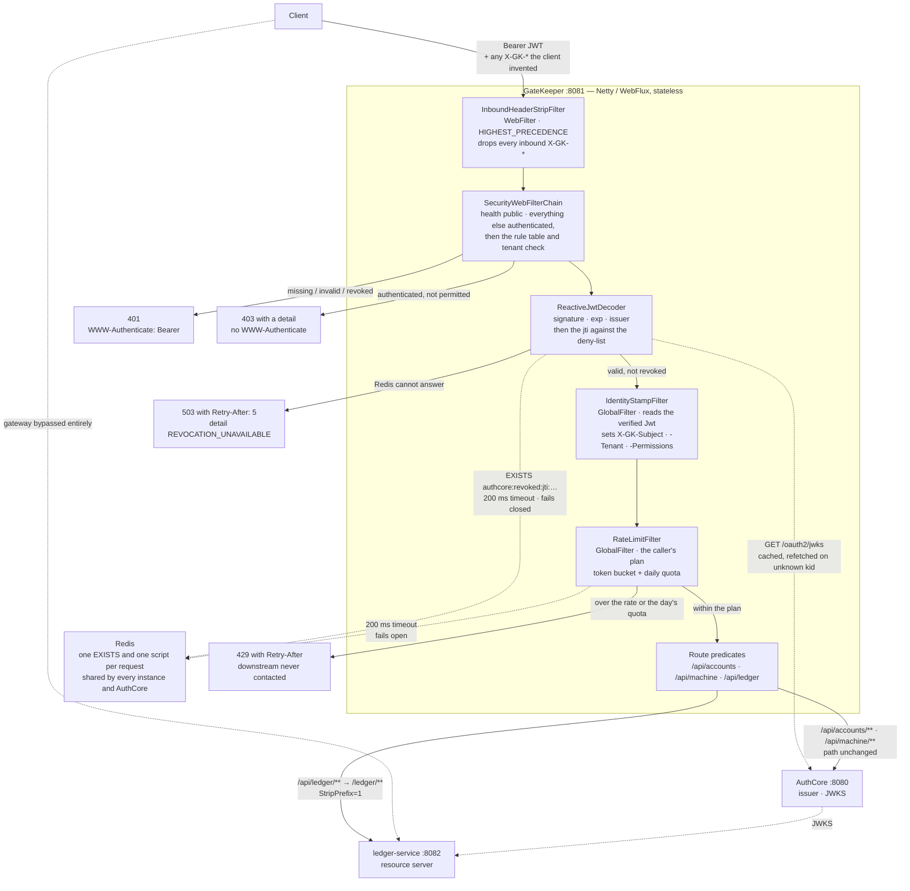

# GateKeeper

A reactive API gateway on Spring Cloud Gateway 5 and Netty, sitting in front of the AuthCore platform. It terminates unauthenticated and out-of-scope traffic at the edge and routes what survives to the service that owns the data.

GateKeeper is the middle service of three. **AuthCore** (`:8080`) authenticates users and issues RS256-signed JWTs. **ledger-service** (`:8082`) owns ledger data and decides, per request, who may read or change it. This service (`:8081`) is the front door: it verifies that a request carries a genuine credential from AuthCore — an unexpired, unrevoked token or an API key — checks that the credential was granted the scope the route requires, holds the caller to its plan's rate and daily quota, and forwards it to the right downstream at the right path.

The thing worth understanding before anything else: **the gateway is a coarse first layer, not the security boundary.** It refuses traffic that obviously does not belong, which keeps unauthenticated and out-of-scope load off the services behind it. Nothing downstream takes its word for anything — ledger-service re-verifies every token against AuthCore's JWKS itself and enforces its own tenant and permission rules whether or not the gateway is in the path.

That division is the whole design. A gateway that owns authorization becomes a single point of failure whose compromise unlocks everything behind it. This one enforces coarse, route-level authorization as defence in depth — **scope at the edge, permission and data ownership downstream** — and owns none of the decisions that matter to the data. Removing it costs a layer, not the boundary: two security checks exist only here for a ledger call — whether the *client application* was granted the scope, described under [Authorization at the edge](#authorization-at-the-edge), and whether the token has been [revoked](#revocation), which AuthCore enforces for its own routes and ledger-service does not check. The other thing that exists only here, [rate limiting](#rate-limiting), is a capacity control rather than a security one.

**Scope:** this repository covers milestones M0–M6 — a reverse proxy that authenticates AuthCore-issued JWTs and API keys, refuses a revoked JWT on its next request at every instance, authorizes each request against a route-to-scope rule table and the token's tenant, limits each caller to its plan's rate and daily quota across every gateway instance sharing one Redis, and propagates the verified caller identity to downstreams. Resilience toward downstreams (M7) is planned and **not built**. [Known limitations](#known-limitations) and [Roadmap](#roadmap) say exactly where the line is.

---

## Contents

- [Quickstart](#quickstart)
- [What it does](#what-it-does)
- [Platform](#platform)
- [Architecture](#architecture)
- [Routes](#routes)
- [Authentication](#authentication)
- [Authorization at the edge](#authorization-at-the-edge)
- [Issuer pinning, and the trap it exists to catch](#issuer-pinning-and-the-trap-it-exists-to-catch)
- [The identity headers it stamps](#the-identity-headers-it-stamps)
- [Rate limiting](#rate-limiting)
- [Revocation](#revocation)
- [Why reactive here, when ledger-service is not](#why-reactive-here-when-ledger-service-is-not)
- [Testing](#testing)
- [Known limitations](#known-limitations)
- [Roadmap](#roadmap)

---

## Quickstart

Requires JDK 21.

```bash
git clone https://github.com/ezat141/gatekeeper.git
cd gatekeeper
./mvnw spring-boot:run        # .\mvnw.cmd on Windows
```

The gateway listens on `:8081`. Health is public:

```bash
curl http://localhost:8081/actuator/health
```

**It starts without AuthCore running.** `NimbusReactiveJwtDecoder.withJwkSetUri(...)` builds its key source lazily — nothing is fetched until the first request that actually needs a signature checked. An unreachable AuthCore is a per-request failure, not a startup failure, which is also why every test in this repository points `jwk-set-uri` at a WireMock stub rather than a real server. **It starts without Redis too**: the startup warm-up waits at most two seconds for Redis and logs a warning if it does not answer. Until it does, the limiter [fails open](#when-redis-fails-requests-go-through) and the revocation check [refuses every bearer token with `503`](#when-redis-cannot-answer-503).

Any request that is not health, with no token, is refused before routing is consulted:

```bash
curl -i http://localhost:8081/api/ledger/entries
# 401, WWW-Authenticate: Bearer
```

To exercise the proxy for real you need the other two services on `:8080` and `:8082`, and a token from AuthCore's authorization-code flow carrying the scope the route requires — `payments:read` for a ledger read, `payments:write` for a write; see [Authorization at the edge](#authorization-at-the-edge). **Obtain it through `localhost`, not `127.0.0.1`** — see [Issuer pinning](#issuer-pinning-and-the-trap-it-exists-to-catch), which is the single most likely reason a valid-looking token gets a `401` here.

Run the suite. WireMock stands in for AuthCore and the downstreams, but the suite needs a real Redis: the API-key, rate-limit and revocation tests read it, and without it the revocation check refuses every bearer token with `503`. This repo has no compose file of its own and shares AuthCore's container:

```bash
docker compose up -d redis   # from the authcore repo
./mvnw test
```

---

## What it does

| Capability | Detail |
|---|---|
| Reverse proxy | Three routes to two downstreams, path predicates, prefix rewriting |
| Path rewriting | `StripPrefix=1` on the ledger route only — deliberately not on the others |
| JWT authentication | Every non-health request must carry a valid, unexpired AuthCore token — or an API key, below |
| Revocation check | Every JWT's `jti` checked against AuthCore's Redis deny-list after its signature and claims pass, so a revoked token is refused `401` on its next request at every instance |
| Fail-closed revocation | When Redis cannot answer, a bearer token is refused `503` after a 200 ms timeout, and at once while the check's own breaker is open — never admitted |
| API-key authentication | `X-API-Key` checked against AuthCore's introspection endpoint, the answer cached in Redis |
| Route authorization | An ordered rule table: each route and method requires authentication, a scope, or a JWT and a scope. Anything the table does not cover is refused |
| Tenant check | Every tenant a request names must equal the token's `tenant` claim |
| Rate limiting | A per-second token bucket per caller — tenant, client or API key — sized by the caller's plan, shared by every instance through Redis. Over it: `429` with a computed `Retry-After` |
| Daily quotas | A per-caller request count per UTC day, checked in the same atomic Redis script as the bucket |
| Fail-open limiter | A Redis failure lets requests through unlimited within 200 ms, rather than taking the gateway down with it |
| JWKS trust anchor | Public keys fetched from AuthCore, never copied into configuration |
| Key rotation support | An unresolvable `kid` triggers a JWKS refetch, so a rotated key is picked up without redeploying |
| Issuer pinning | Tokens from an unexpected `iss` are refused even when the signature is valid |
| Identity propagation | Verified `sub`, `tenant`, and `permissions` stamped downstream as `X-GK-*`, for consumers that are not themselves resource servers |
| Header anti-spoofing | Every inbound `X-GK-*` header removed before authentication runs — prefix-matched, case-insensitive, unconditional |
| Stateless | No session, no CSRF token, and no durable state in the process — rate-limit counts and the API-key cache live in Redis, and nothing about revocation is remembered at all. Killable and restartable at any moment |
| Public health | `/actuator/health` reachable without a credential, so liveness can be probed |

**Stack:** Java 21 · Spring Boot 4.0.7 · Spring Cloud 2025.1.2 (Gateway 5.0.2) · Spring Security 7 reactive · Netty · WireMock

### Why Boot 4.0.7 and not 4.1

AuthCore and ledger-service run Spring Boot 4.1. This service runs **4.0.7**, one minor behind, because Spring Cloud Gateway 5.0.2 is built and tested against that version. Running the officially tested combination removes a class of reactive failures that are genuinely unpleasant to debug.

The version skew is not a compromise to apologise for — it is the clearest evidence that the three services are coupled by a wire contract rather than by shared JARs. They agree on JWKS, on claim names, and on nothing else. If matching Boot versions were required, the coupling would be tighter than advertised.

One packaging note that costs an hour if you hit it: the starter is **`spring-cloud-starter-gateway-server-webflux`**. Spring Cloud Gateway 5.x renamed it; the older `spring-cloud-starter-gateway` coordinate that appears in most tutorials no longer resolves.

---

## Platform

| Service | Port | Owns | Repo |
|---|---|---|---|
| **AuthCore** | `:8080` | Authenticating users, issuing and signing JWTs, publishing JWKS | [ezat141/authcore](https://github.com/ezat141/authcore) |
| **GateKeeper** | `:8081` | Routing, edge rejection of unauthenticated, revoked and out-of-scope traffic, per-plan rate limiting, identity propagation | this repo |
| **ledger-service** | `:8082` | Ledger data, and fine-grained authorization over it | [ezat141/ledger-service](https://github.com/ezat141/ledger-service) |

Each service holds only the public half of AuthCore's signing keys, fetched from JWKS. Only AuthCore holds a private key, and only AuthCore decides anyone's roles or permissions. GateKeeper never issues a token, never mints a claim, and never overrules a downstream's refusal.

---

## Architecture


```mermaid
graph TB
    C["Client"]

    subgraph GK["GateKeeper :8081 — Netty / WebFlux, stateless"]
        STRIP["InboundHeaderStripFilter<br/>WebFilter · HIGHEST_PRECEDENCE<br/>drops every inbound X-GK-*"]
        SEC["SecurityWebFilterChain<br/>health public · everything else authenticated,<br/>then the rule table and tenant check"]
        DEC["ReactiveJwtDecoder<br/>signature · exp · issuer<br/>then the jti against the deny-list"]
        STAMP["IdentityStampFilter<br/>GlobalFilter · reads the verified Jwt<br/>sets X-GK-Subject · -Tenant · -Permissions"]
        RATE["RateLimitFilter<br/>GlobalFilter · the caller's plan<br/>token bucket + daily quota"]
        ROUTE["Route predicates<br/>/api/accounts · /api/machine · /api/ledger"]
    end

    A["AuthCore :8080<br/>issuer · JWKS"]
    L["ledger-service :8082<br/>resource server"]
    RD["Redis<br/>one EXISTS and one script per request<br/>shared by every instance and AuthCore"]

    C -->|"Bearer JWT<br/>+ any X-GK-* the client invented"| STRIP
    STRIP --> SEC
    SEC --> DEC
    DEC -.->|"GET /oauth2/jwks<br/>cached, refetched on unknown kid"| A
    DEC -.->|"EXISTS authcore:revoked:jti:…<br/>200 ms timeout · fails closed"| RD
    DEC -->|"valid, not revoked"| STAMP
    DEC -->|"Redis cannot answer"| R503["503 with Retry-After: 5<br/>detail REVOCATION_UNAVAILABLE"]
    STAMP --> RATE
    RATE -.->|"200 ms timeout<br/>fails open"| RD
    RATE -->|"within the plan"| ROUTE
    RATE -->|"over the rate or the day's quota"| R429["429 with Retry-After<br/>downstream never contacted"]
    SEC -->|"missing / invalid / revoked"| R401["401<br/>WWW-Authenticate: Bearer"]
    SEC -->|"authenticated, not permitted"| R403["403 with a detail<br/>no WWW-Authenticate"]

    ROUTE -->|"/api/accounts/** · /api/machine/**<br/>path unchanged"| A
    ROUTE -->|"/api/ledger/** → /ledger/**<br/>StripPrefix=1"| L

    C -.->|"gateway bypassed entirely"| L
    A -. "JWKS" .-> L
```

Two things in that diagram are load-bearing.

**The strip and the stamp sit on opposite sides of the security chain**, which is why they are two classes rather than one. Stripping has to happen before authentication, on the untouched request, so that no forged header survives into an error path. Stamping cannot happen until after, because the verified `Jwt` does not exist any earlier. No single filter position satisfies both.

**The dashed line from the client straight to ledger-service is a supported path.** Bypassing the gateway gets a caller past none of ledger-service's tenant and permission rules, but it does skip the edge's client-scope check — see [below](#scope-and-permission-who-checks-which) — the revocation check, which ledger-service does not make, and the rate limit, which exists only here.

---

## Routes

Defined declaratively in [`application.yml`](src/main/resources/application.yml).

| Path at the gateway | Downstream | Filters | Path the downstream sees |
|---|---|---|---|
| `/api/accounts/**` | AuthCore `:8080` | none | `/api/accounts/**` — unchanged |
| `/api/machine/**` | AuthCore `:8080` | none | `/api/machine/**` — unchanged |
| `/api/ledger/**` | ledger-service `:8082` | `StripPrefix=1` | `/ledger/**` |

The asymmetry is the interesting part, and it is deliberate. The gateway namespaces every downstream under `/api`, which gives callers one coherent surface. AuthCore already serves `/api/accounts` and `/api/machine` verbatim, so those paths forward untouched. ledger-service serves `/ledger/**` with no `/api` prefix of its own, so that leading segment has to be removed before forwarding.

Getting this backwards fails in a way that is annoying to diagnose: a stripped AuthCore route produces a `404` from AuthCore rather than an error from the gateway, so the gateway looks fine and the downstream looks broken. Three of the four routing tests exist to pin exactly this — `StripPrefix` must apply to the ledger route and must not apply to the other two.

An unmatched path never reaches routing; see [Deny by default](#deny-by-default).

---

## Authentication

A single `SecurityWebFilterChain` ([`GatewaySecurityConfig`](src/main/java/com/gatekeeper/config/GatewaySecurityConfig.java)):

```java
.csrf(ServerHttpSecurity.CsrfSpec::disable)
.httpBasic(ServerHttpSecurity.HttpBasicSpec::disable)
.formLogin(ServerHttpSecurity.FormLoginSpec::disable)
.authorizeExchange(exchange -> exchange
        .pathMatchers("/actuator/health", "/actuator/health/**").permitAll()
        .anyExchange().access(
                new TenantAuthorizationManager(new RouteScopeAuthorizationManager())))
.exceptionHandling(handling -> handling.accessDeniedHandler(accessDeniedHandler))
.oauth2ResourceServer(resourceServer -> resourceServer
        .authenticationEntryPoint(authenticationEntryPoint)
        .bearerTokenConverter(bearerConverterDeferringToApiKey())
        .jwt(jwt -> jwt.jwtDecoder(jwtDecoder)))
.addFilterAt(apiKeyAuthenticationWebFilter(...), SecurityWebFiltersOrder.AUTHENTICATION)
```

CSRF, HTTP Basic, and form login are all off. A credential arrives on every request, so a session would add server-side state and CSRF exposure in exchange for nothing. This chain replaces Boot's default deny-all, which gets installed merely because the resource-server starter is on the classpath.

**Authentication answers one question: is this a genuine, unexpired credential from AuthCore.** Whether the caller may reach a particular route is a separate question, answered by the two managers passed to `access(...)`, which live in a package of their own (`com.gatekeeper.authz`) rather than inside this method — see [Authorization at the edge](#authorization-at-the-edge).

Trust is anchored on AuthCore's JWKS rather than a public key copied into configuration ([`JwtDecoderConfig`](src/main/java/com/gatekeeper/config/JwtDecoderConfig.java)). That is what lets AuthCore rotate its signing key without a redeploy here — and AuthCore does support live rotation, so this matters in practice rather than in principle.

Since M6 the decoder that bean returns is a wrapper: a token that passes the signature and claim checks below is then checked against AuthCore's revocation deny-list — see [Revocation](#revocation).

### What the default validator checks, and what it does not

`JwtValidators.createDefaultWithIssuer(issuer)` composes `X509CertificateThumbprintValidator`, `JwtTimestampValidator` (so `exp`, and `nbf` when present), `JwtTypeValidator`, and a `JwtIssuerValidator` built from the pinned issuer.

**Audience is not validated — and since M5 it is read.** AuthCore emits `aud`, and nothing here validates it, so a token issued to any AuthCore client is accepted here. The [rate limiter](#whose-bucket-a-request-counts-against) does read it, as the identity of a tenant-less token's client.

Not validating it is acceptable *only* because of what the gateway decides and what it leaves downstream. AuthCore leaves `aud` at Spring Authorization Server's default, the id of the client the token was issued to, so it names a client rather than this service — there is no resource-server audience to check it against. Validating it would need AuthCore to name one, through resource indicators or an audience customizer, and nothing in M5 required that change. The downstream resource server still re-verifies the signature, issuer and expiry independently, and checks the user's permissions itself. The gateway's admission decisions — the M4 scope rules — read the scopes AuthCore granted to the token, and AuthCore grants scopes per client: a token can only carry what its *client application* was granted. Checking which client that was would add nothing to those rules.

Reading `aud` as the client's identity, which M5 does, is a different act from validating it, and it is safe: `aud` is inside the signed token and AuthCore sets it from the registered client, so a caller cannot name a bucket of its choosing. The limiter decides *how much* a client may send by who it is; nothing decides *whether* it may send by who it is.

Two conditions would make skipping validation unacceptable, recorded so that a change happens deliberately rather than by inheritance: **the gateway admitting or refusing clients by their identity**, rather than by what they were granted; or **AuthCore issuing the same scope names for another resource server**, so that a scope granted for one audience would pass here — a risk that predates M5 and that M5 does not widen. And one change on AuthCore's side would break the reading: **adopting resource indicators or an audience customizer** — the route to real validation — would make `aud` name a resource server, alone or beside the client. `aud[0]` would then stop naming the client, every client would silently share one bucket, and the limiter's identity must change with it.

---

## Authorization at the edge

Authentication settles who the caller is. Authorization at the edge decides, coarsely, what the caller may reach. [`RouteScopeAuthorizationManager`](src/main/java/com/gatekeeper/authz/RouteScopeAuthorizationManager.java) holds an ordered rule table, and the first rule matching the request's method and path decides. [`TenantAuthorizationManager`](src/main/java/com/gatekeeper/authz/TenantAuthorizationManager.java) wraps it, so no rule can forget the tenant check. Health is permitted ahead of both and never reaches them.

| Path | Method | Requirement |
|---|---|---|
| `/actuator/info` | `GET` | authenticated |
| `/api/accounts/**` | any | authenticated |
| `/api/machine/**` | `GET` | `SCOPE_payments:read` |
| `/api/machine/**` | `POST` | `SCOPE_payments:write` |
| `/api/ledger/**` | `GET` | a JWT, and `SCOPE_payments:read` |
| `/api/ledger/**` | `POST` | a JWT, and `SCOPE_payments:write` |
| anything else | any | **refused** |

Each row is there for a reason.

- **Accounts is authenticated only, deliberately.** AuthCore's real checks there depend on the request's arguments — `@PreAuthorize` against the owner in the path, `hasRole('ADMIN')` — which a route rule cannot see, so AuthCore decides per endpoint. This is why `/api/accounts/**` and `/api/machine/**` are separate routes: a scope rule attaches to the machine route without forcing a hollow one onto accounts.
- **Machine mirrors AuthCore's own two URL rules.** The edge refuses one hop earlier what AuthCore would refuse anyway. One `SCOPE_*` authority covers a client-credentials token and an API key alike, with no branching on the mechanism.
- **Ledger requires a JWT.** ledger-service is a JWT-only resource server, so an API key could only ever get its `401`. The gateway refuses the key with a `403` instead, and strips `X-API-Key` from everything it forwards to ledger.
- **HEAD, PUT, PATCH, DELETE and OPTIONS on machine and ledger are refused**, because no downstream serves them there. No CORS is configured, so a browser client would need a preflight rule of its own.
- **`GET /api/ledger/whoami` needs `payments:read`** like any other ledger read. A token with only `openid profile` is refused there.

### Scope and permission: who checks which

Two vocabularies are in play. A **scope** — the token's `scope` claim, or an API key's scopes — is what the *client application* was granted on the user's behalf. A **permission** — the `permissions` claim — is what the *user* may do, derived from their roles and present only on user tokens. The gateway reads scopes only. ledger-service checks permissions only. AuthCore checks both: scopes on its machine routes, permissions and roles on its accounts endpoints. Each check is made where the information that justifies it lives.

Two consequences follow:

- **Users signed in through `authcore-spa` are read-only on ledger through the gateway, as intended.** That client can only ever be granted `payments:read`. ledger-service enforces the user's permission but not the client's scope, so before M4 a user holding `payments:write` — an `acme` ADMIN, say — could write ledger entries through the gateway from that client, and still can by calling ledger-service directly. The gateway now refuses that write with `MISSING_SCOPE`. Whether ledger-service should also enforce scope is an open decision, recorded in the handoff (`docs/superpowers/HANDOFF-M3-M6.md`, §5).
- **A client-credentials token with `payments:write` passes the edge on a ledger `POST`, and ledger-service then refuses it**, because the token carries no permissions. The edge checked the client's grant; ledger checked the user's, and there is no user.

### The tenant check

No routed path carries a tenant. ledger-service reads the tenant only from the token and filters by it, so a cross-tenant read through ledger cannot be expressed. What a request *can* name is the tenant AuthCore resolves it against: an `X-Tenant` header, or a `tenant` query parameter.

The rule table decides first, and a refusal from it is returned unchanged, so a missing scope always reads as a missing scope. Then, for a JWT carrying a `tenant` claim, **every `X-Tenant` value and every `tenant` query value must equal that claim exactly**:

- case-sensitive — `ACME` is not `acme`, as in AuthCore;
- compared raw, never split — `X-Tenant: acme,default` is one value, and is refused;
- a blank value counts as a named tenant, and is refused;
- query values are compared decoded, as AuthCore sees them — `?tenant=ac%6De` is `acme`.

A request naming no tenant passes. A caller with no `tenant` claim — a client-credentials token, or any API key — is never checked. API keys are not special-cased: M3 left them tenant-less precisely so that one rule would cover them and client-credentials tokens alike.

**An `acme` user must still send `X-Tenant: acme` to reach AuthCore.** Without it AuthCore falls back to `default` and refuses the token itself. The gateway refuses only explicit mismatches; it does not stamp the token's tenant onto the request, which would rewrite the request rather than refuse it and quietly copy one of AuthCore's resolution rules into the gateway.

The check deliberately does not read AuthCore's other tenant sources — the subdomain, a form-encoded body, and AuthCore's session — for the reasons under [Known limitations](#known-limitations).

### The 403

A refusal by an authenticated caller is a `403` in the platform's error shape, with one extra field naming the reason:

```http
HTTP/1.1 403 Forbidden
Content-Type: application/json

{"error":"forbidden","status":403,"path":"/api/ledger/entries","detail":"this route does not accept API keys"}
```

`detail` is always one of four fixed strings authored by the gateway ([`Reason`](src/main/java/com/gatekeeper/authz/Reason.java)), never an exception message:

| Reason | `detail` |
|---|---|
| `MISSING_SCOPE` | `the credential does not carry the scope this route requires` |
| `API_KEY_NOT_ACCEPTED` | `this route does not accept API keys` |
| `TENANT_MISMATCH` | `the request names a tenant other than the token's` |
| `NO_RULE` | `no rule permits this method and path` |

**A `403` carries no `WWW-Authenticate`**: the caller is authenticated, and no challenge would help them. ledger-service's handler states the same contract. Without the gateway's own [`JsonServerAccessDeniedHandler`](src/main/java/com/gatekeeper/error/JsonServerAccessDeniedHandler.java), wired once through `exceptionHandling`, a bearer caller would get an empty body and `WWW-Authenticate: Bearer error="insufficient_scope"` — which would call a tenant mismatch an insufficient scope, and is false.

**A caller with no credential still gets `401` with `WWW-Authenticate: Bearer`**, whichever rule the path matches, and `401` bodies carry no `detail`. **An invalid API key is also `401`**, on the ledger route as anywhere else, because authentication runs before authorization; only a *valid* key reaches the rule table and its `403`.

When a `403` comes back, the body says who answered. The gateway's carries one of the four strings above. AuthCore's own `403`s have an empty body, and ledger-service's carries its own `detail` and ledger's path (`/ledger/...`, no `/api`).

### Deny by default

The table's last rule matches every request and refuses it with `NO_RULE`. A route added later without a rule of its own therefore fails closed, rather than open to every authenticated caller. The price is that **an authenticated caller's typo now reads `403`, not `404`** — less helpful, and deliberate.

Order is load-bearing: a rule inserted above an overlapping one silently shadows it. `RouteScopeAuthorizationManagerTest` pins the whole table, row by row, so a reordering that changes an outcome fails.

### The table and the routes must see the same path

The rule table and the gateway's route predicates both match the parsed request path with the same `PathPattern` engine. That they see the *same* path rests on Spring Security's default `StrictServerWebExchangeFirewall`, which rejects `..`, `//`, encoded slashes, `;`, `%25` and similar before either runs. Without it, `/api/accounts/../machine/payments` would be authorized as the accounts route — authenticated only — and forwarded as the machine route, which requires a scope. `refusesATraversalPathBeforeAnyRuleSeesIt` pins this. Relaxing the firewall, or letting `server.forward-headers-strategy` turn a forwarded prefix into a context path, would reopen it.

---

## Issuer pinning, and the trap it exists to catch

This is the most likely reason a token that looks entirely correct gets a `401` from this service.

AuthCore does not set `issuer-uri`, so Spring Authorization Server derives the issuer from the request host. A token obtained at `127.0.0.1:8080` carries `iss: http://127.0.0.1:8080`. One obtained at `localhost:8080` carries `iss: http://localhost:8080`. Those are different strings, and the validator refuses the mismatch.

Same key. Same signature. Same expiry. Still refused.

```
token minted with iss=http://localhost:8080   → 200, proxied
token minted with iss=http://127.0.0.1:8080   → 401
```

Failing closed is correct — an issuer check that shrugs at a hostname it was not configured for is not an issuer check. The problem is purely that the failure is silent about its cause: you get a bare `401` with nothing indicating that the *issuer* is what was wrong. Hence this section, and hence `refusesATokenFromAnUnexpectedIssuer` in the test suite, which exists specifically to stop someone "fixing" a mysterious `401` by deleting the validator.

**Practical rule:** use `localhost` consistently across all three services. The durable fix is to pin AuthCore's own `issuer-uri` in its `AuthorizationServerSettings`, which makes the issuer deterministic regardless of the host a token was obtained through. That is deliberately not done yet — this milestone is scoped to leave AuthCore untouched.

---

## The identity headers it stamps

ledger-service's README describes three headers — `X-GK-Subject`, `X-GK-Tenant`, `X-GK-Permissions` — and a `GET /ledger/whoami` endpoint that reports them back for inspection. This gateway stamps them, from verified claims only.

The work splits across two filters, and the split is the design rather than an accident of structure.

`InboundHeaderStripFilter` is a `WebFilter` at `HIGHEST_PRECEDENCE`, which puts it ahead of Spring Security's own chain at order `-100`. It removes **every** inbound header whose name begins with `X-GK-`, matched case-insensitively rather than against a fixed list of three, so a fourth header added later cannot silently become spoofable. It strips unconditionally — on every route including permitted ones, and before authentication runs, so a request that fails authentication cannot launder a header through an error path.

`IdentityStampFilter` is a `GlobalFilter`, which runs inside the gateway handler and therefore after Spring Security has authenticated. It reads the verified `Jwt` from `ReactiveSecurityContextHolder` and sets the three headers from its claims. A claim AuthCore omits produces no header at all rather than an empty one a downstream might misread — every client-credentials token lacks `tenant` and `permissions`, so this is the normal case, not an edge one.

One class cannot occupy both positions. Stripping needs the request untouched and must precede authentication; stamping needs the authentication result and cannot precede it.

**These headers are still not authoritative, and that has not changed.** ledger-service re-derives the caller's tenant and permissions from the token's own verified claims and treats `X-GK-*` as informational — its `whoami` endpoint demonstrates exactly that, reporting header-asserted identity beside token-derived identity and flagging any disagreement. The gateway stamping them is a convenience for downstreams that are not themselves resource servers, layered on top of a boundary that was built first and holds without it.

---

## Rate limiting

Authorization decides what a caller may reach. The rate limiter decides how much of it they may use: every routed request counts against its caller's plan twice, once in a per-second token bucket and once in a daily quota that resets at UTC midnight. Both live in Redis, so every gateway instance sharing that Redis enforces one limit, not one each. The M5 design (`docs/superpowers/specs/2026-09-27-gatekeeper-m5-design.md`) is the reference for all of it.

It is a **capacity control, not a security control**. Nothing about who may reach what depends on it — which is what lets it [fail open](#when-redis-fails-requests-go-through) when Redis does.

### Whose bucket a request counts against

| Caller | Identity |
|---|---|
| JWT carrying a `tenant` claim — every user token | `tenant:<slug>` |
| JWT without one — client credentials | `client:<first aud>`, or `client:<sub>` when `aud` is missing or blank |
| API key | `apikey:<name>`, the key's name from introspection |

**Tenant where there is one, otherwise the client.** Every user of `acme` shares `acme`'s plan, which is what a plan for a tenant means; a bucket per user would give a hundred `acme` users a hundred times `acme`'s allowance. A client-credentials token has no tenant, so it counts against its client. There is one bucket and one quota per identity across all routes: a plan's rate is the caller's rate, not a rate per route.

**The client is read from `aud`, which is not validated.** Spring Authorization Server sets an access token's `aud` to the id of the client it was issued to and writes no `client_id` claim, so `aud` is where the client's identity is. On a client-credentials token `sub` is the same client id, which is why it is the fallback. Reading `aud` is safe because it is signed and set by AuthCore from the registered client; why it is still not *validated*, and what would change that, is under [Authentication](#what-the-default-validator-checks-and-what-it-does-not).

A tenant-less token whose `aud` and `sub` are both missing or blank has no identity, and is forwarded unlimited rather than limited. AuthCore cannot issue one, and a single shared bucket for all such tokens would let any one of them exhaust the others.

### Plans

Plans, and who is on which, are gateway configuration in [`application.yml`](src/main/resources/application.yml):

```yaml
gatekeeper:
  rate-limit:
    redis-timeout: 200ms
    default-plan: free
    plans:
      free:
        requests-per-second: 5
        burst: 10
        daily-quota: 1000
      pro:
        requests-per-second: 50
        burst: 100
        daily-quota: 100000
    assignments:
      tenants:
        acme: pro
      clients:
        authcore-machine: pro
      api-keys:
        demo-reporting-job: free
```

`requests-per-second` refills the bucket, `burst` is its capacity, and `daily-quota` counts requests per UTC day. Anyone not assigned is on `default-plan`. A tenant and a client of the same name are assigned independently.

**Why configuration.** No plan data exists anywhere on the platform. A `plan` claim from AuthCore would make this a two-repo change, and a plan change would reach the gateway only as old tokens expired. A plan registry in Redis would have nothing to write it until a management API exists (M9). The cost is stated rather than discovered: the gateway holds business data — who is on which plan — and changing it is a redeploy until M9. The `PlanResolver` interface is where M9 will move that data without touching the limiter.

**Validated at startup; a violation stops the boot:** at least one plan; the default plan exists; every assignment names an existing plan; every value is at least `1`, and burst and daily quota at most `10^12`, a safe ceiling — values near `Long.MAX_VALUE` overflow the script's arithmetic; the timeout is positive; and no key under `gatekeeper.rate-limit` is unknown. The first rule catches a mistyped prefix, which would otherwise bind no plans and start a gateway that limits nothing. The last catches a misspelt `api-key:` for `api-keys:`, which would otherwise put its callers on the default plan without a word.

**Assignments cannot be set through environment variables.** Relaxed binding lowercases an environment variable and splits it on underscores, so a name like `demo-reporting-job` cannot be expressed. Use a mounted configuration file, `SPRING_APPLICATION_JSON`, or command-line arguments.

### Where it runs

`RateLimitFilter` is a `GlobalFilter`, so it runs after Spring Security's whole chain — just after `IdentityStampFilter`, ahead of every routing filter, on all three routes with no route configuration. **Only a request that would reach a downstream is counted.** A `401` or `403` never reaches the limiter's script and never spends a caller's allowance, and the identity above exists only after authentication anyway.

What that does not do, stated: it offers no protection against floods of unauthenticated or forbidden requests. Those cost gateway CPU — and, for random API keys, a negatively cached introspection call — but never reach a downstream. Per-IP flood protection is a different mechanism, and is [not built](#known-limitations).

### In Redis: two hashes and one script

| Key | Fields | Expiry |
|---|---|---|
| `gatekeeper:rl:{<identity>}` | `tokens`, `ts` | `ceil(burst / rate × 2)` seconds, refreshed on each write |
| `gatekeeper:quota:{<identity>}` | `day`, `count` | the next UTC midnight plus one hour |

One Lua script per request ([`check.lua`](src/main/resources/ratelimit/check.lua)) reads both hashes, decides, and writes both. It is atomic, so two instances can never both take the last token.

- **Redis's clock, not the gateway's.** The script reads Redis `TIME` as seconds plus microseconds, so every instance shares one clock and none relies on its own. The microseconds make a bucket refill smoothly at low rates, where Spring's limiter, on whole seconds, does not.
- **The bucket is checked before the quota**, so a request refused for arriving too fast does not also spend the day. **A refusal of either kind writes nothing**: a quota refusal takes no token. **Quota remaining is never negative** — a quota lowered mid-day below what was spent reports `0`.
- **The day is a field, not part of the key.** A script must declare its keys before it runs, and the day is known only from Redis's clock, read inside it. A count whose `day` is not today reads as zero.
- **`{<identity>}` is a Redis Cluster hash tag**, so both keys share a slot, as a multi-key script requires. Any character in an identity outside `[A-Za-z0-9._-]` is percent-encoded, so no name can break the key or its tag.
- **Plan limits are script arguments**, so changing a plan needs no Redis migration.

**Why not Spring Cloud Gateway's `RedisRateLimiter`.** It reads its rates per route id, not per caller, so per-plan rates are impossible without replacing it; its keys give one bucket per route per caller; a denial commits an empty body with no `Retry-After`; and on a Redis error it reports an invented `X-RateLimit-Remaining: -1`. The clock-source idea is kept from it.

### The 429

```http
HTTP/1.1 429 Too Many Requests
Content-Type: application/json
Retry-After: 1
X-RateLimit-Remaining: 0
X-RateLimit-Replenish-Rate: 5
X-RateLimit-Burst-Capacity: 10
X-Quota-Limit: 1000
X-Quota-Remaining: 612
X-Quota-Reset: 41213

{"error":"too_many_requests","status":429,"path":"/api/ledger/entries","detail":"the request rate exceeds the caller's plan"}
```

The platform's error shape, with one of two fixed `detail` strings ([`RateLimitReason`](src/main/java/com/gatekeeper/ratelimit/RateLimitReason.java)). Neither names the plan or the identity:

| Reason | `detail` |
|---|---|
| `RATE_LIMITED` | `the request rate exceeds the caller's plan` |
| `QUOTA_EXCEEDED` | `the caller's daily quota is used up` |

- **`Retry-After` is computed**, in whole seconds and at least `1`: the time to one token for `RATE_LIMITED`, the time to the next UTC midnight for `QUOTA_EXCEEDED`. A caller can act on it, unlike the fixed `5` on the `503`s the gateway returns when AuthCore cannot answer an introspection or Redis cannot answer a revocation check.
- **No `WWW-Authenticate`.** The caller is authenticated; the answer is to wait.
- **The downstream is never contacted.**
- **Written in one place.** [`TooManyRequestsWriter`](src/main/java/com/gatekeeper/error/TooManyRequestsWriter.java) renders it through the same `ErrorBody` as the `401` and `403`, and the filter completes the response itself — no exception, no detour through the global error handler.

**Allowed responses carry the same six `X-RateLimit-*` and `X-Quota-*` headers**, so a well-behaved client can slow down before it is refused. The bucket headers keep Spring's names; the quota headers are the gateway's own, since Spring has no quota. `X-Quota-Reset` is the seconds until the quota resets. **Responses carrying none of these headers:** `401` and `403`, which the limiter runs after; the health probe, which is not routed; and requests let through while Redis is failing.

### When Redis fails, requests go through

The Redis call has its own timeout, `redis-timeout`, 200 ms. On an error or a timeout the request proceeds unlimited, a warning is logged once per outage, and the response carries **no** rate-limit headers rather than invented ones. The rule table and the tenant check use no Redis and keep working, so a Redis outage costs unlimited traffic for its duration, not a platform outage. Refusing with `503` instead would make Redis a hard dependency of every request, JWT callers included.

**M6 decides the opposite, deliberately.** Its [revocation check](#revocation) reads the same Redis, and there a failure refuses: a revoked token getting through is a security failure; an unlimited request is not.

Failing open *fast* took more than a timeout. Each of the following was found by a test or a review, and the M5 design's section 7 records how. Since M6 the connection step and the warm-up live in `com.gatekeeper.redis`, shared with the revocation check, and the breaker class does too, with one instance per consumer:

- **The first connection is made once, off the event loop, by an attempt no request can cancel.** Lettuce opens its shared connection with a blocking wait inside `subscribe()`, before any timeout's clock has started — up to 60 seconds against a Redis that accepts connections and never answers, on whatever thread subscribed. So every Redis consumer connects through a single cached step, `RedisConnectionStep`: a ping on a worker thread, whose success is kept for good and whose failure is not kept at all. A request waits on it within its own timeout; giving up stops the waiting, never the attempt. Cancelling the attempt used to leave one abandoned connection behind per timed-out request — 146 in five seconds of silence, every one going live when Redis answered. Once connected, a check makes no thread hop.
- **A warm-up before traffic.** Before the port binds, `RedisWarmUp` waits up to two seconds on that step and carries on with a warning if Redis does not answer. Without it, the first request after boot would pay for opening the connection, exceed 200 ms, and go through unlimited. The warm-up only opens the connection, not the script: the first request still pays one extra round trip, `EVALSHA` answered `NOSCRIPT` then `EVAL`, which is small.
- **A circuit breaker of its own**, the `rateLimitBreaker` bean; the revocation check has another, which refuses while open. After three consecutive failures or timeouts, the limiter stops calling Redis for five seconds and forwards unlimited; then one request probes, and only the probe's success closes the breaker, while its failure re-opens it at once. Three, not one, because the timeout is measured in the gateway: a single one may be the gateway's own slowness under the very overload a capacity control exists for, and opening on it would switch limiting off for everyone. An isolated failure fails only its own request open, and any success resets the count. This bounds what the limiter adds to Lettuce's unbounded reconnect buffer to about one command per window, keeps worker threads free, and turns an outage into one warning when the breaker opens and one line when it closes, rather than a stack trace per request. **The cost:** once the breaker opens, limiting stays suspended for up to five seconds even if Redis recovers sooner.

API-key callers are a separate matter. M3's introspection cache reads the same Redis and neither fails open nor fails fast — see [Known limitations](#known-limitations).

### Two gateways, one limit

`TwoGatewaysShareOneLimitTest` starts two application contexts on their own ports, sharing one Redis and one WireMock downstream. Requests alternate between them, and the combined burst and the combined quota trip on whichever instance receives the next request. A store counting per instance fails both limit tests, which is the point of them.

It was also run against the real platform: two GateKeeper processes on `:8081` and `:8083`, real AuthCore and ledger-service, one Redis.

- **One quota.** The demo key on a tiny plan (1 per second, burst 3, quota 6): six requests alternating between the instances were allowed, `X-Quota-Remaining` counting 5, 4, 3, 2, 1, 0 across both. The seventh was refused `QUOTA_EXCEEDED` with `Retry-After: 49515` — exactly the seconds to UTC midnight at that moment — and `X-RateLimit-Remaining` stayed at 3, because the refused request took no token.
- **One burst.** A machine token, its client reassigned for this step to a tiny plan with a burst of 3, four requests alternating in 714 ms: `200`, `200`, `200`, then `429 RATE_LIMITED` with `Retry-After: 1` from `:8083`, which had itself seen only one earlier request. A first attempt took 1.7 s and never tripped: each gateway fetched AuthCore's JWKS on its first token, and a token refilled meanwhile. Demonstrating a burst needs the cold path paid first.
- **Plans differ.** The machine client on `pro` showed `X-RateLimit-Burst-Capacity: 100`, `X-RateLimit-Replenish-Rate: 50` and `X-Quota-Limit: 100000`; the demo key on the tiny plan showed a burst of 3.
- **Redis stopped.** The breaker logged one warning after a 200 ms timeout, and requests to ledger answered `200` in 22–26 ms with no rate-limit headers. Requests to the AuthCore routes hung for about 60 seconds and ended `401` — but that was AuthCore, which itself hangs when Redis is down (called directly, it gave no answer in 15 seconds). An API-key caller hung too, on M3's cache.
- **Redis restarted.** Limiting resumed about 15 seconds later — Lettuce's reconnect backoff plus the breaker's window — and the breaker logged one line saying so.

To run two instances yourself, build the jar and start it twice:

```bash
./mvnw -q package -DskipTests
java -jar target/gatekeeper-0.0.1-SNAPSHOT.jar --server.port=8081
java -jar target/gatekeeper-0.0.1-SNAPSHOT.jar --server.port=8083
```

---

## Revocation

AuthCore can revoke a token before it expires, at `POST /oauth2/revoke`, and records the revocation in Redis. Before M6 the gateway did not look, so a revoked token passed the edge until it expired — up to ten minutes for AuthCore's access tokens. Now every bearer JWT is checked against AuthCore's deny-list, and a revoked one is refused on its next request, at every gateway instance. The M6 design (`docs/superpowers/specs/2026-09-30-gatekeeper-m6-design.md`) is the reference for all of it.

It is a **security control**, the opposite of the rate limiter, and that decides its failure mode: when the gateway cannot tell whether a token is revoked, it **refuses**.

### The contract: one key per revoked token

AuthCore's `RevocationService` writes `authcore:revoked:jti:<jti>`, value `"revoked"`, with a TTL equal to the token's remaining lifetime. One `EXISTS` answers the question, and an entry disappears exactly when the token would have expired anyway. The gateway only reads the key; [`RedisRevocationStore`](src/main/java/com/gatekeeper/revocation/RedisRevocationStore.java) owns the prefix, and AuthCore's README names the key as a cross-service contract.

**Nothing is cached in the gateway.** Every JWT request makes one `EXISTS`. A cache of "not revoked" answers would break "refused on the next request" for up to its TTL, at each instance separately, to save one sub-millisecond command on a connection already open for the limiter — and during an outage it would only be a window in which a revoked token gets through. The milestone plan asked for a brief cache; this departs from it deliberately. `TwoGatewaysShareOneLimitTest` asks both instances about a token once, revokes it, and requires both to refuse it next, so it fails the day such a cache is added.

**Only `jti`.** AuthCore records refresh-token families in Postgres and deny-lists nothing for them in Redis, so there is no family key to check: an access token issued from a revoked family runs to its expiry unless it is revoked itself. That is AuthCore's contract to extend, not the gateway's to infer. API keys are not deny-listed either; disabling one in AuthCore takes effect when the gateway's introspection cache expires.

### Where it runs

Inside JWT decoding. [`RevocationCheckingJwtDecoder`](src/main/java/com/gatekeeper/revocation/RevocationCheckingJwtDecoder.java) wraps the Nimbus decoder, and `JwtDecoderConfig` returns the wrapper as the bean.

- **After every other check.** The signature, `exp`, `nbf` and the pinned `iss` are verified first. Only a token that passes all of them reaches Redis, so a forged or expired token — whose `jti` an outsider picks freely — cannot generate Redis load.
- **Before authorization and rate limiting.** A revoked token is not authenticated, so it never receives a `403` that would describe the rule table, never spends a bucket, and is never stamped or forwarded.
- **Where AuthCore checks too**, inside its own JWT validation: a revoked token is one more reason a token is invalid, not a separate concern. There is no new filter, and no filter order to keep.

The milestone plan's `RevocationCheckFilter`, a `GlobalFilter` like the limiter, was rejected: it would run after authorization, so a revoked token could still be answered `403`.

### A revoked token is the ordinary 401

```http
HTTP/1.1 401 Unauthorized
WWW-Authenticate: Bearer
Content-Type: application/json

{"error":"unauthorized","status":401,"path":"/api/machine/payments"}
```

The decoder raises a `BadJwtException`, which Spring Security answers exactly as it answers an expired or forged token. The gateway does not tell a caller why a token was rejected, and revocation is not made the exception.

**A token with no `jti`, or a blank one, gets the same `401`.** It could never be revoked, so it does not pass a gateway that enforces revocation. That costs nothing today — every JWT AuthCore issues carries one — and it is logged at WARN with the token's `sub` and `iss`, because only the issuer can sign such a token. AuthCore's own validator lets such a token through; the two differ deliberately. A revoked token is logged at DEBUG only: its holder can replay it as fast as they like, and the limiter never sees it.

### When Redis cannot answer: 503

An error, a timeout, an empty answer or an open breaker is a `RevocationUnavailableException`. It is deliberately neither a `JwtException` nor an `AuthenticationException`, so Spring Security lets it pass untouched to `GlobalErrorWebExceptionHandler` — the route M3's introspection failure already takes — which answers:

```http
HTTP/1.1 503 Service Unavailable
Retry-After: 5
Content-Type: application/json

{"error":"service_unavailable","status":503,"path":"/api/ledger/entries","detail":"REVOCATION_UNAVAILABLE"}
```

No `WWW-Authenticate`: the token is not the problem. Either status would be a refusal, so the security property holds either way; `503` is the refusal that does least collateral damage.

- **The token is very likely valid.** A `401` tells a well-behaved OAuth client to discard its token and refresh. During this outage a refresh means AuthCore's token endpoint, and AuthCore itself hangs with Redis down: a `401` would turn a Redis outage into a refresh storm against a service that is already stuck. A `503` tells the client to back off and retry the same token.
- **It is M3's precedent** for the same situation — the gateway cannot complete a check that depends on another component — and M3 answers it `503` with `Retry-After: 5`.
- **The `detail` tells the two `503`s apart.** M3's introspection `503` keeps its body unchanged, with no `detail`, and `IntrospectionUnavailableTest` pins that.

`Retry-After: 5` is the breaker's window. The [live run](#against-the-real-platform) found that recovering from an outage can take several times that.

### Failing closed, fast

AuthCore, with Redis stopped, hangs about 60 seconds before answering. A fail-closed check built without care would do the same, so this one reuses what M5 built to [fail open fast](#when-redis-fails-requests-go-through):

- **The shared connection step.** `RedisRevocationStore` waits on the same `RedisConnectionStep` as the limiter and the warm-up, so one Redis still costs one connection attempt at a time, and a silent Redis can neither block an event loop nor leak a connection per timed-out request.
- **A bounded wait:** `gatekeeper.revocation.redis-timeout`, 200 ms, on the store call.
- **A breaker of its own, which refuses.** Failing closed does not stop Lettuce buffering every command without bound while disconnected, so something must stop issuing them. After three consecutive failures the `revocationBreaker` opens, and for five seconds every bearer token is refused `503` without touching Redis; then one request probes, and only its success closes it. **An open breaker refuses; it never skips the check** — copying the limiter's handling of an open breaker would silently fail open. An isolated failure still refuses its own request. Three rather than one matters more here than for the limiter: a breaker that opened on one GC-pause timeout would answer every JWT caller `503` for five seconds.

**Two breakers, one class.** `RedisCircuitBreaker` lives in `com.gatekeeper.redis` and carries a name and a phrase for what its consumer does while it is open, so each log line says truthfully what is happening. The limiter's `rateLimitBreaker` and the check's `revocationBreaker` are injected by qualifier. Each bounds its own consumer's share of Lettuce's buffer to about one command per window, logs its own outage, and counts only its own failures — a request makes one call for each, so a shared count would make "three in a row" mean one and a half requests. A revoked token is Redis answering, so it never counts as a failure.

```yaml
gatekeeper:
  revocation:
    redis-timeout: 200ms
```

There is no default in code, as for the limiter: a missing, zero or negative timeout, or an unknown key under `gatekeeper.revocation`, stops the boot.

### What failing closed costs

- **If Redis is down at boot, JWT callers are answered `503` until it answers.** The warm-up still runs before the port binds and still never fails the boot; its warning names both consequences.
- **During a Redis outage, JWT callers get fast `503`s while API-key callers still hang**, on M3's introspection cache — observed below, and recorded under [Known limitations](#known-limitations).
- **A bearer token sent to `/actuator/health` is authenticated** even though the path is public, so during an outage it is answered `503`. An anonymous health probe is unaffected.
- **Recovery waits for Lettuce to reconnect**, which can take several times the breaker's window — observed below.

### Against the real platform

Run on 2026-10-02 against the real AuthCore, with the gateway started with `java -jar`.

- **Revoked, then refused.** A client-credentials token for `authcore-machine` with `payments:read` (`jti` `9a23e3ae-…`, a 600-second lifetime) got `200` on `GET /api/machine/payments`. `POST /oauth2/revoke` answered `200`, and the next call got `401` with `WWW-Authenticate: Bearer` and the body [above](#a-revoked-token-is-the-ordinary-401). Redis held `authcore:revoked:jti:9a23e3ae-6488-47bd-9b58-3c06018cf32c` with a TTL of about 588 seconds.
- **Redis stopped.** Ten JWT calls were all `503`: the first three in 0.247, 0.229 and 0.228 seconds — the 200 ms timeout — and the next seven in 9–32 ms, with the breaker open. The ledger route answered `503` with `Retry-After: 5`, no `WWW-Authenticate`, and the `REVOCATION_UNAVAILABLE` body [above](#when-redis-cannot-answer-503). The breaker logged one warning — `Revocation check: Redis failed 3 times in a row; refusing bearer-token requests with 503 for 5 s at a time until it answers` — with the `TimeoutException` stack trace as its cause, by design. An API-key caller hung until curl's 15-second limit, as M3's open item predicts.
- **Redis restarted: recovery took 17.8 seconds, not about five.** JWT calls stayed `503` until 17.8 seconds after Redis was up. The breaker probed every five seconds as designed, but its probes at 6.4 and 12.1 seconds each timed out at about 220 ms, because the gateway had not yet reconnected. Lettuce's `ConnectionWatchdog` backs off between reconnect attempts — during this outage they came about 9, 8, 17 and then 30 seconds apart — and the last one reconnected 17 seconds after Redis was up. The breaker closed right after it, logging `Revocation check: Redis answered again; breaker closed`. **So recovery is Lettuce's reconnect delay, which grows with the outage's length up to about 30 seconds, plus up to one breaker window, and JWT callers are refused `503` throughout.** The limiter has the same delay — M5's run saw limiting resume about 15 seconds after a restart — but there it only means requests go unlimited a little longer; here it means refusals. A shorter reconnect delay, Lettuce's `ClientResources.reconnectDelay`, would shorten it; it applies to the whole client, and was deliberately not changed in M6.
- **After recovery**, the token revoked earlier was still `401`: the deny-list survived the Redis restart.

---

## Why reactive here, when ledger-service is not

ledger-service's README argues the servlet side of this: an ordinary CRUD service doing one lookup per request has no reason to pay for a reactive programming model. Both halves of that argument are the same argument, and this is the other half.

A gateway is the component the trade actually favours. It performs almost no per-request CPU work — it matches a predicate, checks a signature, and copies bytes between two connections. What it does do is hold a great many connections open simultaneously, each one idle most of its life waiting on a downstream. On a thread-per-request model, concurrency is capped by the thread pool and most of those threads are parked doing nothing. On Netty, an idle connection costs a socket rather than a thread.

The cost is real and worth naming rather than glossing:

| Servlet habit | Reactive equivalent | What happens if you forget |
|---|---|---|
| `SecurityFilterChain` | `SecurityWebFilterChain` | Bean never applies; Boot's default deny-all stays in force |
| `OncePerRequestFilter` | `GlobalFilter` / `WebFilter` returning `Mono<Void>` | Filter is never invoked |
| `JwtDecoder` | `ReactiveJwtDecoder` | Blocks the event loop on the JWKS fetch |
| `RedisTemplate` | `ReactiveStringRedisTemplate` | Blocks the event loop |
| `JdbcTemplate` in a filter | R2DBC, or pre-load outside the request path | Blocks the event loop |

The failure mode these share is what makes them dangerous: **a blocking call inside a filter does not throw.** It works correctly under the load a developer generates by hand, and it collapses under concurrency, because a handful of parked event-loop threads stall every connection the server is holding. There is no exception to catch and no failing test unless you write one that looks specifically for it.

Using the reactive type is not by itself enough. M5 found that `ReactiveStringRedisTemplate`'s very first command blocks the subscribing thread while Lettuce opens its shared connection — found only because `SilentRedisFailOpenTest` pointed the gateway at a Redis that never answers and the test hung. [When Redis fails](#when-redis-fails-requests-go-through) describes what the limiter does about it.

`GateKeeperApplicationTests.startsAsAReactiveApplicationOnNetty` is a cheap guard against the first way this goes wrong — accidentally pulling in a servlet stack via a transitive `spring-boot-starter-web` and quietly booting on Tomcat, where every reactive assumption above becomes false while everything still compiles and starts.

---

## Testing

```bash
./mvnw test
```

**278 tests.** WireMock stands in for AuthCore's JWKS and introspection endpoints and for the downstream services. Redis does not have a stand-in: the tests that exercise an API key, the rate limiter's script or the deny-list need a real one, started as shown in the [Quickstart](#quickstart), and since M6 so does every test that sends a bearer token, because without Redis the revocation check refuses it `503`. Without Redis, 77 of the 278 fail or never run (45 of 242 before M6, 23 before M5) — a missing container, not a defect, and the new failures are the check refusing correctly. The fail-open and fail-closed tests pass either way, because they bring their own dead or silent Redis.

**Routing and startup**

| Class | Tests | Covers |
|---|---|---|
| `GateKeeperApplicationTests` | 2 | The app is reactive rather than servlet; exactly one security chain is in play |
| `RoutingTest` | 4 | `StripPrefix=1` applied to the ledger route and *not* to either AuthCore route; an unmatched path is refused before routing and reaches no downstream |

**Token authentication**

| Class | Tests | Covers |
|---|---|---|
| `JwtAuthenticationTest` | 7 | No token, valid token, expired token, wrong issuer, bad signature, unknown `kid`, public health |
| `KeyRotationTest` | 3 | A token minted before a rotation still validates while the retiring key is published — the property that makes rotation zero-downtime |
| `IdentityPropagationTest` | 7 | Verified claims stamped downstream; forged headers overwritten; casing variants stripped; absent claims produce no header; the spoof stamping cannot mask |

**API keys**

| Class | Tests | Covers |
|---|---|---|
| `ApiKeyAuthenticationTest` | 10 | The request shape M2 never had to consider: an `X-API-Key` and an `Authorization` header on the same request, and which one wins |
| `ApiKeyReactiveAuthenticationManagerTest` | 11 | The manager against fakes rather than mocks, including TTL clamping and negative TTLs |
| `IntrospectionClientTest` | 7 | The introspection client against a fake AuthCore, each test varying the timeout and resetting stubs so none can see another's state |
| `IntrospectionUnavailableTest` | 4 | An unreachable AuthCore raises a non-`AuthenticationException`, so the filter cannot quietly turn an outage into a `401`; its `503` carries no `detail`, so the revocation check's cannot leak onto it |
| `RedisApiKeyCacheTest` | 5 | The cache against **real Redis** — random keys per test, deleted afterwards, so a shared instance is never polluted |
| `ApiKeyAuthenticationConverterTest` | 5 | Header parsing into a credential |
| `ApiKeyIntrospectionTest` | 1 | What the record's constructor does with a specific wire shape — needs neither Spring nor Redis |
| `ApiKeyPropertiesTest` | 1 | `gatekeeper.api-key.*` actually binds. Relaxed binding leaves a mistyped key silently `null`, so a context that starts does not prove the values arrived |

**Authorization**

| Class | Tests | Covers |
|---|---|---|
| `RouteScopeAuthorizationManagerTest` | 40 | Every row of the rule table against a JWT and an API key, with and without the scope; PUT, DELETE, HEAD and OPTIONS on both, and PATCH on ledger; unknown paths. Each case asserts the specific reason, not merely "denied". A permission never stands in for a scope; an anonymous or unverified caller is denied without a reason |
| `TenantAuthorizationManagerTest` | 19 | Header and query, matching and mismatched; two headers, a comma-joined value, a blank, the wrong case, an encoded value; tenant-less tokens and API keys never checked; a missing scope *and* a wrong tenant reports the scope |
| `AuthorizationTest` | 15 | End to end through WireMock: the acceptance criteria, API keys on ledger (`403`, or `401` when the key is invalid) and on machine, `X-API-Key` stripped from ledger, deny by default, a traversal path refused by the firewall, an anonymous caller still `401`. Every `403` also asserts the downstream received nothing |

**Error contract**

| Class | Tests | Covers |
|---|---|---|
| `ErrorShapeTest` | 2 | One JSON shape — `error`, `status`, `path` — whichever layer refused the request |
| `UnreachableJwksErrorShapeTest` | 1 | An unreachable JWKS reads as a `401`, not the `500` it used to. Separate from `ErrorShapeTest` because one class cannot register two values for `jwk-set-uri` |
| `JsonServerAccessDeniedHandlerTest` | 7 | Each reason renders as its own `detail`; a plain denial gets the generic `detail`, never its exception message; no `WWW-Authenticate` on a `403` |
| `TooManyRequestsWriterTest` | 3 | The `429` body in the platform shape with the given `detail` and headers; no `WWW-Authenticate`; the content type stays JSON whatever headers the caller passes |

**Rate limiting**

| Class | Tests | Covers |
|---|---|---|
| `RateLimitPropertiesTest` | 8 | Each startup rule refuses a bad configuration: no plans, an unknown default or assigned plan, a value below `1` or above `10^12`, a missing or non-positive timeout |
| `RateLimitPropertiesBindingTest` | 2 | `application.yml` binds as written, and the test override makes every shipped plan effectively unlimited so the older suites are never limited |
| `RateLimitPropertiesStrictBindingTest` | 2 | A misspelt assignment kind stops the boot rather than silently binding nothing |
| `ConfiguredPlanResolverTest` | 5 | Each kind of assignment, the default plan, and a tenant and a client of the same name kept apart |
| `RateLimitIdentityTest` | 17 | Tenant, then `aud`, then `sub`; blank values treated as absent; no identity for an anonymous or unauthenticated caller or a blank API-key name; percent-encoding of the key |
| `RedisRateLimitStoreTest` | 11 | The script against **real Redis** with a fixed `now`: the burst, refill at the plan's rate and never past the burst, the quota until UTC midnight and its reset across it, the bucket checked first, refusals that write nothing, quota remaining never negative, key names and expiries, and Redis's own clock when no time is given |
| `RateLimitFilterTest` | 10 | Allowed requests forwarded once with the headers; refusals never forwarded; a failing, silent or empty store fails open; no identity skips the store; an open breaker skips it, and an isolated failure does not skip it for the next caller; a downstream error is not mistaken for Redis failing and forwarded twice; a late answer does not close the breaker |
| `RateLimitTest` | 8 | End to end through WireMock: the `429` after the burst and after the quota, headers on allowed responses, `free` and `pro` differing, one tenant's users sharing a bucket, two clients not, `401`/`403` carrying no headers and touching no Redis, and the health probe carrying none either |
| `TwoGatewaysShareOneLimitTest` | 4 | Two application contexts, one Redis: one combined burst and one combined quota; and a token both instances have already served, once revoked, refused by both on their next call |
| `DeadRedisFailOpenTest` | 1 | A Redis port nobody listens on: `200`, no rate-limit headers. The revocation check is stubbed to "not revoked", so the limiter is the only consumer of the dead Redis |
| `SilentRedisFailOpenTest` | 1 | A Redis that accepts and never answers: every request served within about the timeout, and at most one connection ever opened. The revocation check is stubbed here too |

**Revocation**

| Class | Tests | Covers |
|---|---|---|
| `RevocationCheckingJwtDecoderTest` | 14 | The check with a fake inner decoder, a fake store, and a breaker on a fake clock: a token not revoked passes unchanged, and the store is asked about its own `jti`; revoked, missing and blank `jti` are a `BadJwtException`, the last two without asking the store; a token the inner decoder rejects never reaches the store; an error, an empty answer or a timeout is a `RevocationUnavailableException`; an open breaker refuses without asking the store; a revoked token is not a Redis failure; only the probe's success closes the breaker, and a late success does not; the permit is taken when the check runs, not when the decode is assembled |
| `RedisRevocationStoreTest` | 5 | The store against **real Redis**: an entry written with AuthCore's literal key reads as revoked, an unknown `jti` does not, an expired entry does not — after first proving it was revoked — and the store waits on the connection step |
| `RevocationTest` | 6 | End to end through WireMock and real Redis: a revoked token gets the ordinary `401` in the platform shape with `WWW-Authenticate: Bearer`, the downstream never called and nothing counted against the tenant; a token not revoked is served; a missing or blank `jti` is `401`; an expired token and an API-key caller never reach the store |
| `RevocationPropertiesTest` | 5 | `gatekeeper.revocation.redis-timeout` binds; a missing, zero or negative timeout, or an unknown key, stops the boot |
| `DeadRedisFailClosedTest` | 2 | A Redis port nobody listens on: a bearer token gets `503` with `Retry-After: 5`, the `REVOCATION_UNAVAILABLE` detail and no `WWW-Authenticate`, each in well under a second, from a fresh context so the breaker starts closed; still `503`, never forwarded, once the breaker is open |
| `SilentRedisFailClosedTest` | 1 | A Redis that accepts and never answers: every bearer token refused `503` within about the timeout, nothing forwarded, and exactly one connection accepted |

**Redis connection handling**, shared by the limiter and the revocation check, in `com.gatekeeper.redis`

| Class | Tests | Covers |
|---|---|---|
| `RedisConnectionStepTest` | 4 | One connection attempt at a time: callers who give up neither cancel nor repeat it; a success is kept, a failure is retried, an empty ping is retried |
| `RedisCircuitBreakerTest` | 15 | Opens on three consecutive failures and not on one, any success resetting the count and the count starting again after it closes; denies for the window, lets exactly one caller probe, closes only on the probe's success, re-opens at once on a failed probe, and opens once — not hundreds of times — when answers arrive around the timeout; its opening and closing lines name its consumer and what that consumer does while it is open |
| `RedisWarmUpTest` | 3 | The startup ping returns within its bound when Redis never answers, quietly when it fails, and after one ping when it answers |

Current run, with Redis up: `Tests run: 278, Failures: 0, Errors: 0, Skipped: 0`.

Five earlier tests are worth explaining, because each was written against a specific way the obvious version of the test passes while proving nothing.

**`onlyOneSecurityChainIsInPlay`** asserts there is exactly one `SecurityWebFilterChain` bean. Two chains do not conflict loudly — Spring starts cleanly and `WebFilterChainProxy` silently takes the first that matches. A leftover test-scoped permit-all chain would therefore never announce itself; it would just quietly disable authentication for the whole suite. This test says out loud what would otherwise be invisible.

**`startsAsAReactiveApplicationOnNetty`** checks for an `HttpHandler` bean, which exists only in a WebFlux application. Asserting on a specific context class would have been the obvious approach and is brittle across Boot's package reorganisations; the bean's presence is the stable signal.

**`refusesATokenWithAnInvalidSignature`** and **`refusesATokenWithAnUnknownKeyId`** look near-identical and fail on genuinely different code paths. The first signs with an unpublished key while advertising a `kid` that *is* published — so the decoder finds a key, attempts verification, and the signature does not match. The second advertises a `kid` absent from the JWKS entirely, so the decoder cannot resolve a key at all, refetches the key set, and only then gives up. Collapsing them into one test would leave the refetch path untested.

That refetch is why the second test asserts on the WireMock request count rather than only on the `401`:

```java
assertThat(authCore.findAll(getRequestedFor(urlEqualTo("/oauth2/jwks"))))
        .as("an unresolvable kid must trigger a JWKS refetch, since that is what "
                + "lets a rotated key be picked up without a redeploy")
        .isNotEmpty();
```

Nimbus throws on an empty candidate-key list whether or not a refetch was attempted, so asserting only the status code would pass just as happily against an implementation with refresh-on-miss removed — and removing it would silently break key rotation, which is the entire reason this service trusts a JWKS URL instead of a copied key. The test has to watch for the refetch rather than infer it from the outcome.

**`stripsASpoofedHeaderTheStampFilterWouldNotOverwrite`** exists because the four obvious anti-spoofing tests are all blind. Delete `InboundHeaderStripFilter` entirely and they keep passing — `IdentityStampFilter` calls `headers.set(...)`, which replaces a forged value case-insensitively whether or not anything stripped it first. The one case stamping cannot mask is a claim the token does not carry: a client-credentials token has no `tenant`, so the stamp filter's `if (tenant != null)` guard skips that header and leaves whatever the client sent. That is the only scenario where a spoofed header would actually reach a downstream, and it is therefore the only test that fails when the strip filter is removed — verified by deleting the file and watching precisely one of the five go red.

The M4 tests were checked the same way — each change below was made on purpose, and each made its named tests fail: removing the tenant wrapper fails both cross-tenant tests; letting API keys onto the ledger rule fails the key-on-ledger test; replacing deny-by-default with `authenticated()` fails the three deny-by-default tests; removing the `exceptionHandling` wiring fails every `403`-shape test for JWT and key callers alike; removing `RemoveRequestHeader` fails the header test; reading only the header for the tenant fails the query tests.

The M5 tests were checked the same way. Deleting the quota check from the script fails the quota tests; checking the quota before the bucket fails `checksTheBucketBeforeTheQuota` and `neverReportsANegativeQuotaRemaining`; a store counting per instance fails both two-gateway limit tests; removing the fail-open path fails the fail-open tests; a constant `Retry-After` fails three `429` tests; ignoring the tenant fails `aUserTokenCountsAgainstItsTenant` and `usersOfOneTenantShareABucket`; a breaker that any success closes fails three breaker and filter tests; a threshold of one fails `oneFailureDoesNotOpenIt`, a success that does not reset the count fails `aSuccessResetsTheCount`, and a failed probe that counts toward three fails `aFailedProbeReopensAtOnce`; and an uncached connection step fails two connect tests. One check found a gap: `usersOfOneTenantShareABucket` sent both users through the same client, so it passed whether the bucket belonged to the tenant or the client. It now sends every request through a fresh client, so the tenant is the only thing they share, and it fails when the tenant is ignored.

The M6 tests were checked the same way, with ten mutations, and every one turned at least one test red: the store always answering "not revoked"; a token with no `jti` admitted; an open breaker skipping the check instead of refusing; the unavailable check mapped to `401`; a store failure admitting the token; the check made before the inner decoder rather than after it; a five-second in-process cache of "not revoked"; `JwtDecoderConfig` returning the Nimbus decoder unwrapped; the revocation `503` without its `detail`; and that `detail` leaking onto M3's introspection `503`. Two gaps were found and closed before the sweep. The dead-Redis timing test could run after its sibling had already opened the breaker, so every request it timed was refused without touching Redis, and a mutation delaying each refusal by 1.5 seconds passed; it now starts from a fresh context, and that mutation fails it. And the silent-Redis test accepted *at most* one connection, which zero also satisfies; it now requires exactly one.

---

## Known limitations

Honest about what this is not, yet. Several of these are the direct consequence of M0–M6 being a deliberately narrow slice. The handoff (`docs/superpowers/HANDOFF-M3-M6.md`, §5) keeps the open items the milestones' reviews and runs found, with an owner for each.

- **Identity headers are informational, not authoritative.** They are stamped from verified claims and inbound ones are stripped — see [the section above](#the-identity-headers-it-stamps) — but no downstream should authorize on them, and ledger-service deliberately does not. Treating `X-GK-*` as a trust signal would make every service behind this gateway depend on the gateway being unbypassable, which it is not.

- **Tenant sources the gateway does not read.** The [tenant check](#the-tenant-check) compares the `X-Tenant` header and the `tenant` query parameter. AuthCore resolves a tenant from three more places, and the gateway reads none of them:
  - **The subdomain.** Spring Cloud Gateway replaces the client's `Host` with the downstream's unless a route adds `PreserveHostHeader`, and none does, so a client's subdomain never reaches AuthCore. Confirmed against the running services: an `acme` token sent with `X-Tenant: acme` and `Host: default.localhost:8081` gets `200` — AuthCore consults the subdomain before `X-Tenant`, so a forwarded `Host` would have made it `403`. This holds only while `spring.cloud.gateway.server.webflux.trusted-proxies` is unset; with trusted proxies configured, the client's host travels on as `X-Forwarded-Host`, which AuthCore would honour if it ever ran with a forward-headers strategy.
  - **A form-encoded body.** AuthCore reads the parameter through servlet `getParameter`, which also parses a form POST body; the gateway does not read bodies at authorization time. Confirmed: a form body of `tenant=acme` with no header gets `200`, the same request with no body gets AuthCore's `403`, and `tenant=default` in the body gets `403` from AuthCore rather than from the gateway — until an `X-Tenant: default` header is added, which the gateway refuses with `TENANT_MISMATCH`.
  - **AuthCore's session.** When a request names no tenant, AuthCore falls back to the tenant in the caller's session, read from any `JSESSIONID` cookie. The gateway forwards cookies. Stripping `Cookie` on the two AuthCore routes would close this at the edge; that is a behaviour change still to be decided.

  **None of these is an escalation.** AuthCore compares whatever tenant it resolved with the token's own claim and refuses a mismatch. The edge check is defence in depth; AuthCore remains the authority for its data.

- **A request the firewall rejects gets a bare `400`.** Spring Security's `StrictServerWebExchangeFirewall` refuses `..`, `//`, encoded slashes, `;`, `%25` and similar with an empty-bodied `400` — outside the platform's JSON error shape. It is Spring's default and predates M4; M4 only came to depend on it (see [the section above](#the-table-and-the-routes-must-see-the-same-path)).

- ~~**A JWKS fetch failure returns `500`, not the `401` it should.**~~ **Fixed.** `ReactiveRemoteJWKSource.getJWKSet()`'s `WebClientRequestException` is wrapped as `IllegalStateException("Could not obtain the keys", ...)` inside `NimbusReactiveJwtDecoder`, and `JwtReactiveAuthenticationManager.authenticate()` maps only `JwtException` to a `401`, so the `IllegalStateException` used to reach Boot's default handler unmapped and misreport an authentication failure as a server fault. `GlobalErrorWebExceptionHandler` now recognises it, and `UnreachableJwksErrorShapeTest` stops the `500` returning.

- ~~**No unified error shape.**~~ **Fixed.** `GlobalErrorWebExceptionHandler` renders one JSON shape — `error`, `status`, `path` — whichever layer refused the request, and ledger-service matches it one hop downstream. `ErrorShapeTest` pins it.

- **Audience is read but not validated** — why that is safe, and what would change it, is under [Authentication](#what-the-default-validator-checks-and-what-it-does-not).

- **An OIDC ID token picks its own bucket.** An ID token carries the client as `aud`, the username as `sub`, and no `tenant`, and — the open M4 item — it may authenticate here. So it counts against its client rather than the user's tenant: a user holding both tokens can choose which of two buckets to spend, and ID-token callers from every tenant share one. Stopping ID tokens from authenticating here closes both.

- **No per-IP flood protection.** The limiter counts only authenticated, authorized requests, by the caller's identity. A flood of unauthenticated or forbidden requests is refused without reaching a downstream, but costs gateway CPU and, for random API keys, negatively cached introspection calls. Limiting by IP before authentication is a different mechanism, and is not built.

- **API-key callers neither fail open nor fail fast when Redis does.** M3's introspection cache reads the same Redis through the same client. Observed live with Redis stopped: an API-key caller hung, waiting in Lettuce's reconnect buffer up to the command timeout, and a Redis that accepts connections and never answers could block an event loop on the cache's first connection. The contrast since M6 is stark: in the M6 run, JWT callers were refused `503` in 9–247 ms while an API-key caller hung until curl gave up at 15 seconds. The limiter and the revocation check bound only their own shares; Lettuce buffers commands without limit while disconnected, and rejecting them client-wide would change M3's behaviour, so it was not done here. Separately, AuthCore itself hangs when Redis is down, so its routes answer late whatever the gateway does.

- **Redis's clock stepping backwards.** Refill is never negative, so after a backward step a drained bucket stays drained — refused with `Retry-After: 1` — until Redis's clock passes the stored time again, and a step back across midnight resets the day's count. The triggers are an NTP step on the Redis host or a failover to a replica with a skewed clock.

- **A downstream's own `X-RateLimit-*` or `X-Quota-*` headers would be duplicated.** Spring Cloud Gateway appends a downstream's response headers to those the gateway set, so a downstream sending the same names would produce two of each. None does today; setting the headers in `beforeCommit` would fix it.

- **The warm-up's two seconds, and both breakers' five-second window and threshold of three failures, are constants, not properties**, and the warm-up does not run under lazy initialisation.

- **Recovering from a Redis outage takes as long as Lettuce takes to reconnect.** Lettuce backs off between reconnect attempts, by up to about 30 seconds as an outage lengthens, and neither breaker's probe can succeed until it has reconnected. In the M6 run JWT callers were refused `503` for 17.8 seconds after Redis came back, against a breaker window of five; the limiter lags the same way, where it costs only a longer unlimited stretch. A shorter reconnect delay would apply to the whole Redis client and was deliberately not set — see [Against the real platform](#against-the-real-platform).

- **Downstream URIs are static configuration.** Two hardcoded `localhost` URLs, no service discovery, no health-aware load balancing. Fine for a single-instance local platform, insufficient for more than one instance of anything.

- **No resilience toward downstreams.** No circuit breaker, no timeout, no retry, no bulkhead on a routed call. A downstream that hangs will hold gateway connections until the client gives up. (The rate limiter's and the revocation check's timeouts and breakers guard only their own Redis calls.) Nor does the JWKS fetch have a response timeout: Spring Security builds its `WebClient` bare, so an AuthCore that accepts the connection and never answers hangs the request. M7 owns both.

- ~~**No rate limiting or quotas.**~~ **Built in M5** — see [Rate limiting](#rate-limiting).

- ~~**No revocation check.**~~ **Built in M6** — see [Revocation](#revocation). What remains: **ledger-service does not consult the deny-list**, so a revoked token sent straight to it, bypassing the gateway, is accepted until it expires. Revocation takes effect at AuthCore and at the edge. Only individual tokens are deny-listed — a revoked refresh-token family leaves the access tokens already issued from it valid until they expire — and API keys revoke through AuthCore's `enabled` flag and M3's cache TTL, not the deny-list.

- **The `gateway` actuator endpoint is off.** Not an oversight, and not fixable by adding it to `management.endpoints.web.exposure.include` — Spring Cloud Gateway annotates that endpoint `@RestControllerEndpoint(defaultAccess = NONE)`, and the access check short-circuits before exposure is consulted, so it would still never register. Turning it on needs `management.endpoint.gateway.access: read-only`, and then a rule of its own in the authorization table, which today refuses every `/actuator` path except health and info with `NO_RULE`. There is now an authorization model to hang such a rule off; deciding who may read the full route table is still its own decision, so the endpoint stays off.

---

## Roadmap

| | Milestone | Status |
|---|---|---|
| M0 | Skeleton on Netty, health endpoint | ✅ |
| M1 | Routing to AuthCore and ledger-service, prefix rewriting | ✅ |
| M2 | JWT authentication against JWKS, issuer pinning | ✅ |
| M3 | Identity propagation and inbound `X-GK-*` stripping | ✅ |
| M3 | API-key authentication, with Redis-cached introspection | ✅ |
| M4 | Route → scope authorization, tenant enforcement at the edge | ✅ |
| M5 | Distributed rate limiting and per-plan quotas (Redis) | ✅ |
| M6 | Revocation check against AuthCore's deny-list | ✅ |
| M7 | Resilience — circuit breaker, timeout, retry, bulkhead | planned |
| M8 | Audit events to Kafka, observability | planned |
| M9 | Dynamic route and plan administration | planned |
| M10 | Hardening, load test, CI/CD | planned |

---

## License

MIT
