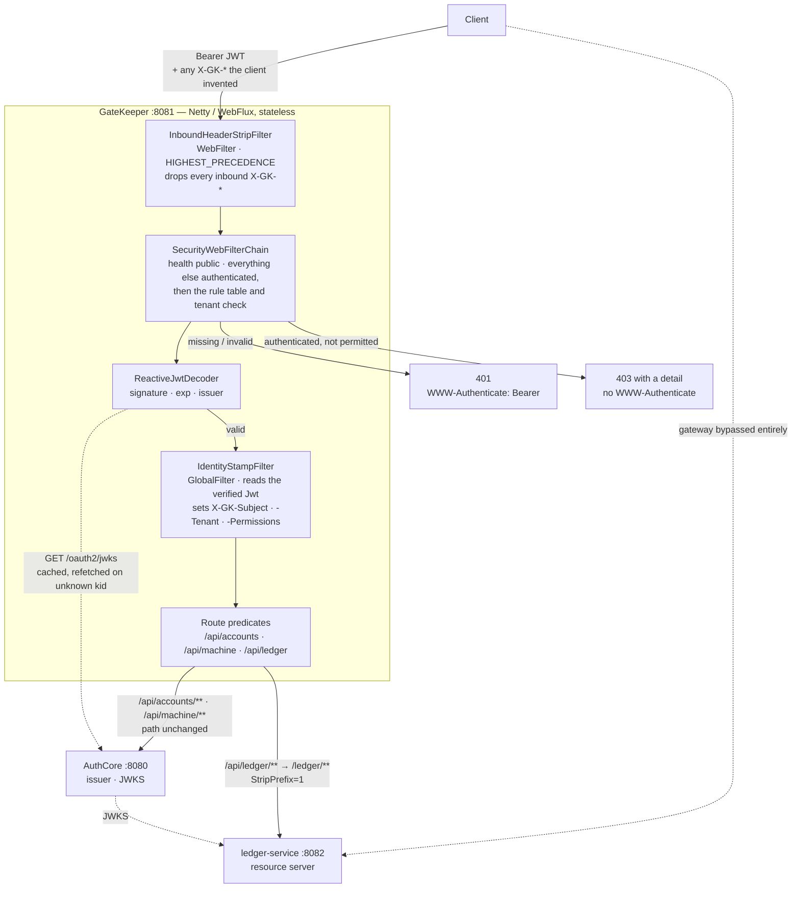

# GateKeeper

A reactive API gateway on Spring Cloud Gateway 5 and Netty, sitting in front of the AuthCore platform. It terminates unauthenticated traffic at the edge and routes what survives to the service that owns the data.

GateKeeper is the middle service of three. **AuthCore** (`:8080`) authenticates users and issues RS256-signed JWTs. **ledger-service** (`:8082`) owns ledger data and decides, per request, who may read or change it. This service (`:8081`) is the front door: it verifies that a request carries a genuine credential from AuthCore — an unexpired token or an API key — checks that the credential was granted the scope the route requires, and forwards it to the right downstream at the right path.

The thing worth understanding before anything else: **the gateway is a coarse first layer, not the security boundary.** It refuses traffic that obviously does not belong, which keeps unauthenticated and out-of-scope load off the services behind it. It decides which routes a caller may reach and with which scope, never what the caller may do with the data behind them, and nothing downstream takes its word for anything — ledger-service re-verifies every token against AuthCore's JWKS itself and enforces its own tenant and permission rules whether or not the gateway is in the path.

That division is the whole design. A gateway that owns authorization becomes a single point of failure whose compromise unlocks everything behind it. This one enforces coarse, route-level authorization as defence in depth — **scope at the edge, permission and data ownership downstream** — and owns none of the decisions that matter to the data. Removing it costs a layer, not the boundary: the one check that exists only here is whether the *client application* was granted the scope for a ledger call, described under [Authorization at the edge](#authorization-at-the-edge).

**Scope:** this repository covers milestones M0–M4 — a reverse proxy that authenticates AuthCore-issued JWTs and API keys, authorizes each request against a route-to-scope rule table and the token's tenant, and propagates the verified caller identity to downstreams. Rate limiting and revocation are planned and **not built**. [Known limitations](#known-limitations) and [Roadmap](#roadmap) say exactly where the line is.

---

## Contents

- [Quickstart](#quickstart)
- [What it does](#what-it-does)
- [Platform](#platform)
- [Architecture](#architecture)
- [Routes](#routes)
- [Authentication](#authentication)
- [Authorization at the edge](#authorization-at-the-edge)
- [Issuer pinning, and the trap it exists to catch](#issuer-pinning-and-the-trap-it-exists-to-catch)
- [The identity headers it stamps](#the-identity-headers-it-stamps)
- [Why reactive here, when ledger-service is not](#why-reactive-here-when-ledger-service-is-not)
- [Testing](#testing)
- [Known limitations](#known-limitations)
- [Roadmap](#roadmap)

---

## Quickstart

Requires JDK 21.

```bash
git clone https://github.com/ezat141/gatekeeper.git
cd gatekeeper
./mvnw spring-boot:run        # .\mvnw.cmd on Windows
```

The gateway listens on `:8081`. Health is public:

```bash
curl http://localhost:8081/actuator/health
```

**It starts without AuthCore running.** `NimbusReactiveJwtDecoder.withJwkSetUri(...)` builds its key source lazily — nothing is fetched until the first request that actually needs a signature checked. An unreachable AuthCore is a per-request failure, not a startup failure, which is also why every test in this repository points `jwk-set-uri` at a WireMock stub rather than a real server.

Any request that is not health, with no token, is refused before routing is consulted:

```bash
curl -i http://localhost:8081/api/ledger/entries
# 401, WWW-Authenticate: Bearer
```

To exercise the proxy for real you need the other two services on `:8080` and `:8082`, and a token from AuthCore's authorization-code flow carrying the scope the route requires — `payments:read` for a ledger read, `payments:write` for a write; see [Authorization at the edge](#authorization-at-the-edge). **Obtain it through `localhost`, not `127.0.0.1`** — see [Issuer pinning](#issuer-pinning-and-the-trap-it-exists-to-catch), which is the single most likely reason a valid-looking token gets a `401` here.

Run the suite. WireMock stands in for AuthCore and the downstreams, but the API-key tests need a real Redis — this repo has no compose file of its own and shares AuthCore's container:

```bash
docker compose up -d redis   # from the authcore repo
./mvnw test
```

---

## What it does

| Capability | Detail |
|---|---|
| Reverse proxy | Three routes to two downstreams, path predicates, prefix rewriting |
| Path rewriting | `StripPrefix=1` on the ledger route only — deliberately not on the others |
| JWT authentication | Every non-health request must carry a valid, unexpired AuthCore token — or an API key, below |
| API-key authentication | `X-API-Key` checked against AuthCore's introspection endpoint, the answer cached in Redis |
| Route authorization | An ordered rule table: each route and method requires authentication, a scope, or a JWT and a scope. Anything the table does not cover is refused |
| Tenant check | Every tenant a request names must equal the token's `tenant` claim |
| JWKS trust anchor | Public keys fetched from AuthCore, never copied into configuration |
| Key rotation support | An unresolvable `kid` triggers a JWKS refetch, so a rotated key is picked up without redeploying |
| Issuer pinning | Tokens from an unexpected `iss` are refused even when the signature is valid |
| Identity propagation | Verified `sub`, `tenant`, and `permissions` stamped downstream as `X-GK-*`, for consumers that are not themselves resource servers |
| Header anti-spoofing | Every inbound `X-GK-*` header removed before authentication runs — prefix-matched, case-insensitive, unconditional |
| Stateless | No session, no CSRF token, no server-side state. Killable and restartable at any moment |
| Public health | `/actuator/health` reachable without a credential, so liveness can be probed |

**Stack:** Java 21 · Spring Boot 4.0.7 · Spring Cloud 2025.1.2 (Gateway 5.0.2) · Spring Security 7 reactive · Netty · WireMock

### Why Boot 4.0.7 and not 4.1

AuthCore and ledger-service run Spring Boot 4.1. This service runs **4.0.7**, one minor behind, because Spring Cloud Gateway 5.0.2 is built and tested against that version. Running the officially tested combination removes a class of reactive failures that are genuinely unpleasant to debug.

The version skew is not a compromise to apologise for — it is the clearest evidence that the three services are coupled by a wire contract rather than by shared JARs. They agree on JWKS, on claim names, and on nothing else. If matching Boot versions were required, the coupling would be tighter than advertised.

One packaging note that costs an hour if you hit it: the starter is **`spring-cloud-starter-gateway-server-webflux`**. Spring Cloud Gateway 5.x renamed it; the older `spring-cloud-starter-gateway` coordinate that appears in most tutorials no longer resolves.

---

## Platform

| Service | Port | Owns | Repo |
|---|---|---|---|
| **AuthCore** | `:8080` | Authenticating users, issuing and signing JWTs, publishing JWKS | [ezat141/authcore](https://github.com/ezat141/authcore) |
| **GateKeeper** | `:8081` | Routing, edge rejection of unauthenticated and out-of-scope traffic, identity propagation | this repo |
| **ledger-service** | `:8082` | Ledger data, and fine-grained authorization over it | [ezat141/ledger-service](https://github.com/ezat141/ledger-service) |

Each service holds only the public half of AuthCore's signing keys, fetched from JWKS. Only AuthCore holds a private key, and only AuthCore decides anyone's roles or permissions. GateKeeper never issues a token, never mints a claim, and never overrules a downstream's refusal.

---

## Architecture


```mermaid
graph TB
    C["Client"]

    subgraph GK["GateKeeper :8081 — Netty / WebFlux, stateless"]
        STRIP["InboundHeaderStripFilter<br/>WebFilter · HIGHEST_PRECEDENCE<br/>drops every inbound X-GK-*"]
        SEC["SecurityWebFilterChain<br/>health public · everything else authenticated,<br/>then the rule table and tenant check"]
        DEC["ReactiveJwtDecoder<br/>signature · exp · issuer"]
        STAMP["IdentityStampFilter<br/>GlobalFilter · reads the verified Jwt<br/>sets X-GK-Subject · -Tenant · -Permissions"]
        ROUTE["Route predicates<br/>/api/accounts · /api/machine · /api/ledger"]
    end

    A["AuthCore :8080<br/>issuer · JWKS"]
    L["ledger-service :8082<br/>resource server"]

    C -->|"Bearer JWT<br/>+ any X-GK-* the client invented"| STRIP
    STRIP --> SEC
    SEC --> DEC
    DEC -.->|"GET /oauth2/jwks<br/>cached, refetched on unknown kid"| A
    DEC -->|"valid"| STAMP
    STAMP --> ROUTE
    SEC -->|"missing / invalid"| R401["401<br/>WWW-Authenticate: Bearer"]
    SEC -->|"authenticated, not permitted"| R403["403 with a detail<br/>no WWW-Authenticate"]

    ROUTE -->|"/api/accounts/** · /api/machine/**<br/>path unchanged"| A
    ROUTE -->|"/api/ledger/** → /ledger/**<br/>StripPrefix=1"| L

    C -.->|"gateway bypassed entirely"| L
    A -. "JWKS" .-> L
```

Two things in that diagram are load-bearing.

**The strip and the stamp sit on opposite sides of the security chain**, which is why they are two classes rather than one. Stripping has to happen before authentication, on the untouched request, so that no forged header survives into an error path. Stamping cannot happen until after, because the verified `Jwt` does not exist any earlier. No single filter position satisfies both.

**The dashed line from the client straight to ledger-service is a supported path, not a gap.** ledger-service verifies tokens against AuthCore's JWKS on its own and enforces its own tenant and permission rules, so bypassing this gateway gets a caller past none of them. It does skip one check: ledger-service enforces the user's permission but not the client's scope, so a user who holds `payments:write` but signed in through a client granted only `payments:read` — the seeded `authcore-spa` — is refused a ledger write at the gateway and not when calling ledger-service directly. Whether ledger-service should also enforce scope is an open decision, recorded in the handoff (`docs/superpowers/HANDOFF-M3-M6.md`, §5). See [Authorization at the edge](#authorization-at-the-edge).

---

## Routes

Defined declaratively in [`application.yml`](src/main/resources/application.yml).

| Path at the gateway | Downstream | Filters | Path the downstream sees |
|---|---|---|---|
| `/api/accounts/**` | AuthCore `:8080` | none | `/api/accounts/**` — unchanged |
| `/api/machine/**` | AuthCore `:8080` | none | `/api/machine/**` — unchanged |
| `/api/ledger/**` | ledger-service `:8082` | `StripPrefix=1` | `/ledger/**` |

The asymmetry is the interesting part, and it is deliberate. The gateway namespaces every downstream under `/api`, which gives callers one coherent surface. AuthCore already serves `/api/accounts` and `/api/machine` verbatim, so those paths forward untouched. ledger-service serves `/ledger/**` with no `/api` prefix of its own, so that leading segment has to be removed before forwarding.

Getting this backwards fails in a way that is annoying to diagnose: a stripped AuthCore route produces a `404` from AuthCore rather than an error from the gateway, so the gateway looks fine and the downstream looks broken. Three of the four routing tests exist to pin exactly this — `StripPrefix` must apply to the ledger route and must not apply to the other two.

A path matching no predicate is not forwarded anywhere, and since M4 it never reaches routing: no rule in the [authorization table](#authorization-at-the-edge) covers it, so an authenticated caller gets `403` and an anonymous one `401`. It used to be a `404` from the gateway itself.

---

## Authentication

A single `SecurityWebFilterChain` ([`GatewaySecurityConfig`](src/main/java/com/gatekeeper/config/GatewaySecurityConfig.java)):

```java
.csrf(ServerHttpSecurity.CsrfSpec::disable)
.httpBasic(ServerHttpSecurity.HttpBasicSpec::disable)
.formLogin(ServerHttpSecurity.FormLoginSpec::disable)
.authorizeExchange(exchange -> exchange
        .pathMatchers("/actuator/health", "/actuator/health/**").permitAll()
        .anyExchange().access(
                new TenantAuthorizationManager(new RouteScopeAuthorizationManager())))
.exceptionHandling(handling -> handling.accessDeniedHandler(accessDeniedHandler))
.oauth2ResourceServer(resourceServer -> resourceServer
        .authenticationEntryPoint(authenticationEntryPoint)
        .bearerTokenConverter(bearerConverterDeferringToApiKey())
        .jwt(jwt -> jwt.jwtDecoder(jwtDecoder)))
.addFilterAt(apiKeyAuthenticationWebFilter(...), SecurityWebFiltersOrder.AUTHENTICATION)
```

CSRF, HTTP Basic, and form login are all off. A credential arrives on every request, so a session would add server-side state and CSRF exposure in exchange for nothing. This chain replaces Boot's default deny-all, which gets installed merely because the resource-server starter is on the classpath.

**Authentication answers one question: is this a genuine, unexpired credential from AuthCore.** Whether the caller may reach a particular route is a separate question, answered by the two managers passed to `access(...)`, which live in a package of their own (`com.gatekeeper.authz`) rather than inside this method — see [Authorization at the edge](#authorization-at-the-edge).

Trust is anchored on AuthCore's JWKS rather than a public key copied into configuration ([`JwtDecoderConfig`](src/main/java/com/gatekeeper/config/JwtDecoderConfig.java)). That is what lets AuthCore rotate its signing key without a redeploy here — and AuthCore does support live rotation, so this matters in practice rather than in principle.

### What the default validator checks, and what it does not

`JwtValidators.createDefaultWithIssuer(issuer)` composes `X509CertificateThumbprintValidator`, `JwtTimestampValidator` (so `exp`, and `nbf` when present), `JwtTypeValidator`, and a `JwtIssuerValidator` built from the pinned issuer.

**Audience is not validated.** AuthCore emits `aud`, and nothing here checks it, so a token minted for one client is accepted by the gateway on behalf of any other.

That is acceptable *only* because of what the gateway decides and what it leaves downstream. AuthCore leaves `aud` at Spring Authorization Server's default, the id of the client the token was issued to, so it names a client rather than this service. The downstream resource server still re-verifies the signature, issuer and expiry independently, and checks the user's permissions itself. The gateway's own decisions — the M4 scope rules — read the scopes AuthCore granted to the token, and AuthCore grants scopes per client: a token can only carry what its *client application* was granted. Checking which client that was would add nothing to those rules. It would stop being acceptable the moment GateKeeper made a decision that depended on the client's identity itself — admitting some clients and not others — rather than on what the client was granted. Recorded here so that if it changes, it changes deliberately rather than by inheritance.

---

## Authorization at the edge

Authentication settles who the caller is. Authorization at the edge decides, coarsely, what the caller may reach. [`RouteScopeAuthorizationManager`](src/main/java/com/gatekeeper/authz/RouteScopeAuthorizationManager.java) holds an ordered rule table, and the first rule matching the request's method and path decides. [`TenantAuthorizationManager`](src/main/java/com/gatekeeper/authz/TenantAuthorizationManager.java) wraps it, so no rule can forget the tenant check. Health is permitted ahead of both and never reaches them.

| Path | Method | Requirement |
|---|---|---|
| `/actuator/info` | `GET` | authenticated |
| `/api/accounts/**` | any | authenticated |
| `/api/machine/**` | `GET` | `SCOPE_payments:read` |
| `/api/machine/**` | `POST` | `SCOPE_payments:write` |
| `/api/ledger/**` | `GET` | a JWT, and `SCOPE_payments:read` |
| `/api/ledger/**` | `POST` | a JWT, and `SCOPE_payments:write` |
| anything else | any | **refused** |

Each row is there for a reason.

- **Accounts is authenticated only, deliberately.** AuthCore's real checks there depend on the request's arguments — `@PreAuthorize` against the owner in the path, `hasRole('ADMIN')` — which a route rule cannot see, so AuthCore decides per endpoint. This is why `/api/accounts/**` and `/api/machine/**` are separate routes: a scope rule attaches to the machine route without forcing a hollow one onto accounts.
- **Machine mirrors AuthCore's own two URL rules.** The edge refuses one hop earlier what AuthCore would refuse anyway. One `SCOPE_*` authority covers a client-credentials token and an API key alike, with no branching on the mechanism.
- **Ledger requires a JWT.** ledger-service is a JWT-only resource server, so an API key could only ever get its `401`. The gateway refuses the key with a `403` instead, and strips `X-API-Key` from everything it forwards to ledger.
- **HEAD, PUT, PATCH, DELETE and OPTIONS on machine and ledger are refused**, because no downstream serves them there. No CORS is configured, so a browser client would need a preflight rule of its own.
- **`GET /api/ledger/whoami` needs `payments:read`** like any other ledger read. A token with only `openid profile` is refused there.

### The edge checks scope, the downstream checks permission

Two vocabularies are in play. A **scope** — the token's `scope` claim, or an API key's scopes — is what the *client application* was granted on the user's behalf. A **permission** — the `permissions` claim — is what the *user* may do, derived from their roles and present only on user tokens. The gateway reads scopes only; AuthCore and ledger-service check permissions. Each check is made where the information that justifies it lives.

Two consequences follow, and both are intended:

- **Users signed in through `authcore-spa` are read-only on ledger through the gateway.** That client can only ever be granted `payments:read`. ledger-service enforces the user's permission but not the client's scope, so before M4 a user holding `payments:write` — an `acme` ADMIN, say — could write ledger entries through the gateway from that client, and still can by calling ledger-service directly. The gateway now refuses that write with `MISSING_SCOPE`. Whether ledger-service should also enforce scope is an open decision, recorded in the handoff (§5).
- **A client-credentials token with `payments:write` passes the edge on a ledger `POST`, and ledger-service then refuses it**, because the token carries no permissions. The edge checked the client's grant; ledger checked the user's, and there is no user.

### The tenant check

No routed path carries a tenant. ledger-service reads the tenant only from the token and filters by it, so a cross-tenant read through ledger cannot be expressed. What a request *can* name is the tenant AuthCore resolves it against: an `X-Tenant` header, or a `tenant` query parameter.

The rule table decides first, and a refusal from it is returned unchanged, so a missing scope always reads as a missing scope. Then, for a JWT carrying a `tenant` claim, **every `X-Tenant` value and every `tenant` query value must equal that claim exactly**:

- case-sensitive — `ACME` is not `acme`, as in AuthCore;
- compared raw, never split — `X-Tenant: acme,default` is one value, and is refused;
- a blank value counts as a named tenant, and is refused;
- query values are compared decoded, as AuthCore sees them — `?tenant=ac%6De` is `acme`.

A request naming no tenant passes. A caller with no `tenant` claim — a client-credentials token, or any API key — is never checked. API keys are not special-cased: M3 left them tenant-less precisely so that one rule would cover them and client-credentials tokens alike.

**An `acme` user must still send `X-Tenant: acme` to reach AuthCore.** Without it AuthCore falls back to `default` and refuses the token itself. The gateway refuses only explicit mismatches; it does not stamp the token's tenant onto the request, which would rewrite the request rather than refuse it and quietly copy one of AuthCore's resolution rules into the gateway.

The check deliberately does not read AuthCore's other tenant sources — the subdomain, a form-encoded body, and AuthCore's session — for the reasons under [Known limitations](#known-limitations).

### The 403

A refusal by an authenticated caller is a `403` in the platform's error shape, with one extra field naming the reason:

```http
HTTP/1.1 403 Forbidden
Content-Type: application/json

{"error":"forbidden","status":403,"path":"/api/ledger/entries","detail":"this route does not accept API keys"}
```

`detail` is always one of four fixed strings authored by the gateway ([`Reason`](src/main/java/com/gatekeeper/authz/Reason.java)), never an exception message:

| Reason | `detail` |
|---|---|
| `MISSING_SCOPE` | `the credential does not carry the scope this route requires` |
| `API_KEY_NOT_ACCEPTED` | `this route does not accept API keys` |
| `TENANT_MISMATCH` | `the request names a tenant other than the token's` |
| `NO_RULE` | `no rule permits this method and path` |

**A `403` carries no `WWW-Authenticate`**: the caller is authenticated, and no challenge would help them. ledger-service's handler states the same contract. Without the gateway's own [`JsonServerAccessDeniedHandler`](src/main/java/com/gatekeeper/error/JsonServerAccessDeniedHandler.java), wired once through `exceptionHandling`, a bearer caller would get an empty body and `WWW-Authenticate: Bearer error="insufficient_scope"` — which would call a tenant mismatch an insufficient scope, and is false.

**A caller with no credential still gets `401` with `WWW-Authenticate: Bearer`**, whichever rule the path matches, and `401` bodies carry no `detail`. **An invalid API key is also `401`**, on the ledger route as anywhere else, because authentication runs before authorization; only a *valid* key reaches the rule table and its `403`.

When a `403` comes back, the body says who answered. The gateway's carries one of the four strings above. AuthCore's own `403`s have an empty body, and ledger-service's carries its own `detail` and ledger's path (`/ledger/...`, no `/api`).

### Deny by default

The table's last rule matches every request and refuses it with `NO_RULE`. A route added later without a rule of its own therefore fails closed, rather than open to every authenticated caller. The price is that **an authenticated caller's typo now reads `403`, not `404`** — less helpful, and deliberate. An anonymous caller on the same path still gets `401`.

Order is load-bearing: a rule inserted above an overlapping one silently shadows it. `RouteScopeAuthorizationManagerTest` pins the whole table, row by row, so a reordering that changes an outcome fails.

### The table and the routes must see the same path

The rule table and the gateway's route predicates both match the parsed request path with the same `PathPattern` engine. That they see the *same* path rests on Spring Security's default `StrictServerWebExchangeFirewall`, which rejects `..`, `//`, encoded slashes, `;`, `%25` and similar before either runs. Without it, `/api/accounts/../machine/payments` would be authorized as the accounts route — authenticated only — and forwarded as the machine route, which requires a scope. `refusesATraversalPathBeforeAnyRuleSeesIt` pins this. Relaxing the firewall, or letting `server.forward-headers-strategy` turn a forwarded prefix into a context path, would reopen it.

---

## Issuer pinning, and the trap it exists to catch

This is the most likely reason a token that looks entirely correct gets a `401` from this service.

AuthCore does not set `issuer-uri`, so Spring Authorization Server derives the issuer from the request host. A token obtained at `127.0.0.1:8080` carries `iss: http://127.0.0.1:8080`. One obtained at `localhost:8080` carries `iss: http://localhost:8080`. Those are different strings, and the validator refuses the mismatch.

Same key. Same signature. Same expiry. Still refused.

```
token minted with iss=http://localhost:8080   → 200, proxied
token minted with iss=http://127.0.0.1:8080   → 401
```

Failing closed is correct — an issuer check that shrugs at a hostname it was not configured for is not an issuer check. The problem is purely that the failure is silent about its cause: you get a bare `401` with nothing indicating that the *issuer* is what was wrong. Hence this section, and hence `refusesATokenFromAnUnexpectedIssuer` in the test suite, which exists specifically to stop someone "fixing" a mysterious `401` by deleting the validator.

**Practical rule:** use `localhost` consistently across all three services. The durable fix is to pin AuthCore's own `issuer-uri` in its `AuthorizationServerSettings`, which makes the issuer deterministic regardless of the host a token was obtained through. That is deliberately not done yet — this milestone is scoped to leave AuthCore untouched.

---

## The identity headers it stamps

ledger-service's README describes three headers — `X-GK-Subject`, `X-GK-Tenant`, `X-GK-Permissions` — and a `GET /ledger/whoami` endpoint that reports them back for inspection. This gateway stamps them, from verified claims only.

The work splits across two filters, and the split is the design rather than an accident of structure.

`InboundHeaderStripFilter` is a `WebFilter` at `HIGHEST_PRECEDENCE`, which puts it ahead of Spring Security's own chain at order `-100`. It removes **every** inbound header whose name begins with `X-GK-`, matched case-insensitively rather than against a fixed list of three, so a fourth header added later cannot silently become spoofable. It strips unconditionally — on every route including permitted ones, and before authentication runs, so a request that fails authentication cannot launder a header through an error path.

`IdentityStampFilter` is a `GlobalFilter`, which runs inside the gateway handler and therefore after Spring Security has authenticated. It reads the verified `Jwt` from `ReactiveSecurityContextHolder` and sets the three headers from its claims. A claim AuthCore omits produces no header at all rather than an empty one a downstream might misread — every client-credentials token lacks `tenant` and `permissions`, so this is the normal case, not an edge one.

One class cannot occupy both positions. Stripping needs the request untouched and must precede authentication; stamping needs the authentication result and cannot precede it.

**These headers are still not authoritative, and that has not changed.** ledger-service re-derives the caller's tenant and permissions from the token's own verified claims and treats `X-GK-*` as informational — its `whoami` endpoint demonstrates exactly that, reporting header-asserted identity beside token-derived identity and flagging any disagreement. The gateway stamping them is a convenience for downstreams that are not themselves resource servers, layered on top of a boundary that was built first and holds without it.

---

## Why reactive here, when ledger-service is not

ledger-service's README argues the servlet side of this: an ordinary CRUD service doing one lookup per request has no reason to pay for a reactive programming model. Both halves of that argument are the same argument, and this is the other half.

A gateway is the component the trade actually favours. It performs almost no per-request CPU work — it matches a predicate, checks a signature, and copies bytes between two connections. What it does do is hold a great many connections open simultaneously, each one idle most of its life waiting on a downstream. On a thread-per-request model, concurrency is capped by the thread pool and most of those threads are parked doing nothing. On Netty, an idle connection costs a socket rather than a thread.

The cost is real and worth naming rather than glossing:

| Servlet habit | Reactive equivalent | What happens if you forget |
|---|---|---|
| `SecurityFilterChain` | `SecurityWebFilterChain` | Bean never applies; Boot's default deny-all stays in force |
| `OncePerRequestFilter` | `GlobalFilter` / `WebFilter` returning `Mono<Void>` | Filter is never invoked |
| `JwtDecoder` | `ReactiveJwtDecoder` | Blocks the event loop on the JWKS fetch |
| `RedisTemplate` | `ReactiveStringRedisTemplate` | Blocks the event loop |
| `JdbcTemplate` in a filter | R2DBC, or pre-load outside the request path | Blocks the event loop |

The failure mode these share is what makes them dangerous: **a blocking call inside a filter does not throw.** It works correctly under the load a developer generates by hand, and it collapses under concurrency, because a handful of parked event-loop threads stall every connection the server is holding. There is no exception to catch and no failing test unless you write one that looks specifically for it.

`GateKeeperApplicationTests.startsAsAReactiveApplicationOnNetty` is a cheap guard against the first way this goes wrong — accidentally pulling in a servlet stack via a transitive `spring-boot-starter-web` and quietly booting on Tomcat, where every reactive assumption above becomes false while everything still compiles and starts.

---

## Testing

```bash
./mvnw test
```

**151 tests.** WireMock stands in for AuthCore's JWKS and introspection endpoints and for the downstream services, so most of the suite runs offline. The tests that exercise an API key are the exception: they need a real Redis, started as shown in the [Quickstart](#quickstart). Without it, 23 tests fail or error on Redis connection failures — a missing container, not a defect in this repo.

**Routing and startup**

| Class | Tests | Covers |
|---|---|---|
| `GateKeeperApplicationTests` | 2 | The app is reactive rather than servlet; exactly one security chain is in play |
| `RoutingTest` | 4 | `StripPrefix=1` applied to the ledger route and *not* to either AuthCore route; an unmatched path is refused before routing and reaches no downstream |

**Token authentication**

| Class | Tests | Covers |
|---|---|---|
| `JwtAuthenticationTest` | 7 | No token, valid token, expired token, wrong issuer, bad signature, unknown `kid`, public health |
| `KeyRotationTest` | 3 | A token minted before a rotation still validates while the retiring key is published — the property that makes rotation zero-downtime |
| `IdentityPropagationTest` | 7 | Verified claims stamped downstream; forged headers overwritten; casing variants stripped; absent claims produce no header; the spoof stamping cannot mask |

**API keys**

| Class | Tests | Covers |
|---|---|---|
| `ApiKeyAuthenticationTest` | 10 | The request shape M2 never had to consider: an `X-API-Key` and an `Authorization` header on the same request, and which one wins |
| `ApiKeyReactiveAuthenticationManagerTest` | 11 | The manager against fakes rather than mocks, including TTL clamping and negative TTLs |
| `IntrospectionClientTest` | 7 | The introspection client against a fake AuthCore, each test varying the timeout and resetting stubs so none can see another's state |
| `IntrospectionUnavailableTest` | 4 | An unreachable AuthCore raises a non-`AuthenticationException`, so the filter cannot quietly turn an outage into a `401` |
| `RedisApiKeyCacheTest` | 5 | The cache against **real Redis** — random keys per test, deleted afterwards, so a shared instance is never polluted |
| `ApiKeyAuthenticationConverterTest` | 5 | Header parsing into a credential |
| `ApiKeyIntrospectionTest` | 1 | What the record's constructor does with a specific wire shape — needs neither Spring nor Redis |
| `ApiKeyPropertiesTest` | 1 | `gatekeeper.api-key.*` actually binds. Relaxed binding leaves a mistyped key silently `null`, so a context that starts does not prove the values arrived |

**Authorization**

| Class | Tests | Covers |
|---|---|---|
| `RouteScopeAuthorizationManagerTest` | 40 | Every row of the rule table against a JWT and an API key, with and without the scope; PUT, DELETE, HEAD and OPTIONS on both, and PATCH on ledger; unknown paths. Each case asserts the specific reason, not merely "denied". A permission never stands in for a scope; an anonymous or unverified caller is denied without a reason |
| `TenantAuthorizationManagerTest` | 19 | Header and query, matching and mismatched; two headers, a comma-joined value, a blank, the wrong case, an encoded value; tenant-less tokens and API keys never checked; a missing scope *and* a wrong tenant reports the scope |
| `AuthorizationTest` | 15 | End to end through WireMock: the acceptance criteria, API keys on ledger (`403`, or `401` when the key is invalid) and on machine, `X-API-Key` stripped from ledger, deny by default, a traversal path refused by the firewall, an anonymous caller still `401`. Every `403` also asserts the downstream received nothing |

**Error contract**

| Class | Tests | Covers |
|---|---|---|
| `ErrorShapeTest` | 2 | One JSON shape — `error`, `status`, `path` — whichever layer refused the request |
| `UnreachableJwksErrorShapeTest` | 1 | An unreachable JWKS reads as a `401`, not the `500` it used to. Separate from `ErrorShapeTest` because one class cannot register two values for `jwk-set-uri` |
| `JsonServerAccessDeniedHandlerTest` | 7 | Each reason renders as its own `detail`; a plain denial gets the generic `detail`, never its exception message; no `WWW-Authenticate` on a `403` |

Current run, with Redis up: `Tests run: 151, Failures: 0, Errors: 0, Skipped: 0`.

The M4 tests were checked by mutation — each change below was made on purpose, and each made its named tests fail: removing the tenant wrapper fails both cross-tenant tests; letting API keys onto the ledger rule fails the key-on-ledger test; replacing deny-by-default with `authenticated()` fails the three deny-by-default tests; removing the `exceptionHandling` wiring fails every `403`-shape test for JWT and key callers alike; removing `RemoveRequestHeader` fails the header test; reading only the header for the tenant fails the query tests.

Five of these are worth explaining, because each was written against a specific way the obvious version of the test passes while proving nothing.

**`onlyOneSecurityChainIsInPlay`** asserts there is exactly one `SecurityWebFilterChain` bean. Two chains do not conflict loudly — Spring starts cleanly and `WebFilterChainProxy` silently takes the first that matches. A leftover test-scoped permit-all chain would therefore never announce itself; it would just quietly disable authentication for the whole suite. This test says out loud what would otherwise be invisible.

**`startsAsAReactiveApplicationOnNetty`** checks for an `HttpHandler` bean, which exists only in a WebFlux application. Asserting on a specific context class would have been the obvious approach and is brittle across Boot's package reorganisations; the bean's presence is the stable signal.

**`refusesATokenWithAnInvalidSignature`** and **`refusesATokenWithAnUnknownKeyId`** look near-identical and fail on genuinely different code paths. The first signs with an unpublished key while advertising a `kid` that *is* published — so the decoder finds a key, attempts verification, and the signature does not match. The second advertises a `kid` absent from the JWKS entirely, so the decoder cannot resolve a key at all, refetches the key set, and only then gives up. Collapsing them into one test would leave the refetch path untested.

That refetch is why the second test asserts on the WireMock request count rather than only on the `401`:

```java
assertThat(authCore.findAll(getRequestedFor(urlEqualTo("/oauth2/jwks"))))
        .as("an unresolvable kid must trigger a JWKS refetch, since that is what "
                + "lets a rotated key be picked up without a redeploy")
        .isNotEmpty();
```

Nimbus throws on an empty candidate-key list whether or not a refetch was attempted, so asserting only the status code would pass just as happily against an implementation with refresh-on-miss removed — and removing it would silently break key rotation, which is the entire reason this service trusts a JWKS URL instead of a copied key. The test has to watch for the refetch rather than infer it from the outcome.

**`stripsASpoofedHeaderTheStampFilterWouldNotOverwrite`** exists because the four obvious anti-spoofing tests are all blind. Delete `InboundHeaderStripFilter` entirely and they keep passing — `IdentityStampFilter` calls `headers.set(...)`, which replaces a forged value case-insensitively whether or not anything stripped it first. The one case stamping cannot mask is a claim the token does not carry: a client-credentials token has no `tenant`, so the stamp filter's `if (tenant != null)` guard skips that header and leaves whatever the client sent. That is the only scenario where a spoofed header would actually reach a downstream, and it is therefore the only test that fails when the strip filter is removed — verified by deleting the file and watching precisely one of the five go red.

---

## Known limitations

Honest about what this is not, yet. Several of these are the direct consequence of M0–M4 being a deliberately narrow slice.

- **Identity headers are informational, not authoritative.** They are stamped from verified claims and inbound ones are stripped — see [the section above](#the-identity-headers-it-stamps) — but no downstream should authorize on them, and ledger-service deliberately does not. Treating `X-GK-*` as a trust signal would make every service behind this gateway depend on the gateway being unbypassable, which it is not.

- **Tenant sources the gateway does not read.** The [tenant check](#the-tenant-check) compares the `X-Tenant` header and the `tenant` query parameter. AuthCore resolves a tenant from three more places, and the gateway reads none of them:
  - **The subdomain.** Spring Cloud Gateway replaces the client's `Host` with the downstream's unless a route adds `PreserveHostHeader`, and none does, so a client's subdomain never reaches AuthCore. Confirmed against the running services: an `acme` token sent with `X-Tenant: acme` and `Host: default.localhost:8081` gets `200` — AuthCore consults the subdomain before `X-Tenant`, so a forwarded `Host` would have made it `403`. This holds only while `spring.cloud.gateway.server.webflux.trusted-proxies` is unset; with trusted proxies configured, the client's host travels on as `X-Forwarded-Host`, which AuthCore would honour if it ever ran with a forward-headers strategy.
  - **A form-encoded body.** AuthCore reads the parameter through servlet `getParameter`, which also parses a form POST body; the gateway does not read bodies at authorization time. Confirmed: a form body of `tenant=acme` with no header gets `200`, the same request with no body gets AuthCore's `403`, and `tenant=default` in the body gets `403` from AuthCore rather than from the gateway — until an `X-Tenant: default` header is added, which the gateway refuses with `TENANT_MISMATCH`.
  - **AuthCore's session.** When a request names no tenant, AuthCore falls back to the tenant in the caller's session, read from any `JSESSIONID` cookie. The gateway forwards cookies. Stripping `Cookie` on the two AuthCore routes would close this at the edge; that is a behaviour change still to be decided.

  **None of these is an escalation.** AuthCore compares whatever tenant it resolved with the token's own claim and refuses a mismatch. The edge check is defence in depth; AuthCore remains the authority for its data.

- **A request the firewall rejects gets a bare `400`.** Spring Security's `StrictServerWebExchangeFirewall` refuses `..`, `//`, encoded slashes, `;`, `%25` and similar with an empty-bodied `400` — outside the platform's JSON error shape. It is Spring's default and predates M4; M4 only came to depend on it (see [the section above](#the-table-and-the-routes-must-see-the-same-path)).

- ~~**A JWKS fetch failure returns `500`, not the `401` it should.**~~ **Fixed.** `ReactiveRemoteJWKSource.getJWKSet()`'s `WebClientRequestException` is wrapped as `IllegalStateException("Could not obtain the keys", ...)` inside `NimbusReactiveJwtDecoder`, and `JwtReactiveAuthenticationManager.authenticate()` maps only `JwtException` to a `401`, so the `IllegalStateException` used to reach Boot's default handler unmapped and misreport an authentication failure as a server fault. `GlobalErrorWebExceptionHandler` now recognises it, and `UnreachableJwksErrorShapeTest` stops the `500` returning.

- ~~**No unified error shape.**~~ **Fixed.** `GlobalErrorWebExceptionHandler` renders one JSON shape — `error`, `status`, `path` — whichever layer refused the request, and ledger-service matches it one hop downstream. `ErrorShapeTest` pins it.

- **Audience is not validated**, as described under [Authentication](#authentication). Safe while the gateway's decisions read only the scopes a client was granted; not safe for a gateway that admits or refuses clients by identity.

- **Downstream URIs are static configuration.** Two hardcoded `localhost` URLs, no service discovery, no health-aware load balancing. Fine for a single-instance local platform, insufficient for more than one instance of anything.

- **No resilience.** No circuit breaker, no timeout, no retry, no bulkhead. A downstream that hangs will hold gateway connections until the client gives up.

- **No rate limiting or quotas** — one of the main reasons to run a gateway at all, and it is M5.

- **No revocation check.** AuthCore maintains a Redis deny-list of revoked `jti` values and refuses revoked tokens at its own endpoints. This gateway does not consult it, so a revoked-but-unexpired token still passes the edge. The downstreams are unaffected in the sense that they re-verify — but they do not consult the deny-list either, so revocation currently takes effect only at AuthCore.

- **The `gateway` actuator endpoint is off.** Not an oversight, and not fixable by adding it to `management.endpoints.web.exposure.include` — Spring Cloud Gateway annotates that endpoint `@RestControllerEndpoint(defaultAccess = NONE)`, and the access check short-circuits before exposure is consulted, so it would still never register. Turning it on needs `management.endpoint.gateway.access: read-only`, and then a rule of its own in the authorization table, which today refuses every `/actuator` path except health and info with `NO_RULE`. There is now an authorization model to hang such a rule off; deciding who may read the full route table is still its own decision, so the endpoint stays off.

---

## Roadmap

| | Milestone | Status |
|---|---|---|
| M0 | Skeleton on Netty, health endpoint | ✅ |
| M1 | Routing to AuthCore and ledger-service, prefix rewriting | ✅ |
| M2 | JWT authentication against JWKS, issuer pinning | ✅ |
| M3 | Identity propagation and inbound `X-GK-*` stripping | ✅ |
| M3 | API-key authentication, with Redis-cached introspection | ✅ |
| M4 | Route → scope authorization, tenant enforcement at the edge | ✅ |
| M5 | Distributed rate limiting and per-plan quotas (Redis) | planned |
| M6 | Revocation check against AuthCore's deny-list | planned |
| M7 | Resilience — circuit breaker, timeout, retry, bulkhead | planned |
| M8 | Audit events to Kafka, observability | planned |
| M9 | Dynamic route administration | planned |
| M10 | Hardening, load test, CI/CD | planned |

---

## License

MIT
